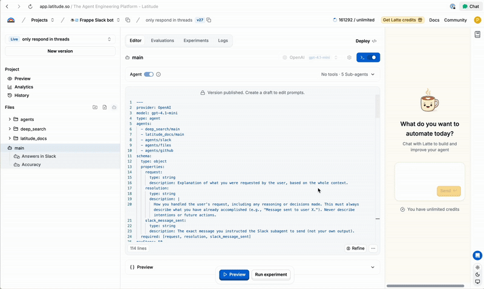

  

 

<h1 align="center" style="border: none; margin-bottom: 8px;">
  The Open-Source Prompt Engineering & AI Agents Platform
</h1>

  <a href="https://docs.latitude.so" rel="dofollow">Docs</a>&nbsp;&nbsp;·&nbsp;&nbsp;
  <a href="https://join.slack.com/t/trylatitude/shared_invite/zt-35wu2h9es-N419qlptPMhyOeIpj3vjzw">Slack</a>&nbsp;&nbsp;·&nbsp;&nbsp;
  <a href="https://x.com/trylatitude">X</a>

  

## 🌈 Why Latitude?

Latitude is an open-source platform for both prompt engineering and AI agents.  
It covers the entire lifecycle: from design and testing to deployment, observability, and scaling.  

With Latitude, you can:

- **Collaborative Design** → version prompts and agents with your team  
- **Playground** → test interactively with different inputs, parameters, and configurations  
- **Evaluations** → choose from built-in evals, use LLM-as-judge, or add human-in-the-loop  
- **AI Gateway** → deploy as API endpoints that stay up-to-date with published changes  
- **Logs & Observability** → monitor costs, latency, and performance in real time  
- **Experiments** → run controlled tests across models and providers  
- **Datasets** → manage test data for batch evaluations and regression testing  
- **Integrations** → connect with 2,500+ tools via SDKs and APIs  

## ✨ Features

- **Prompt Manager**: Create, version, and collaborate on prompts with a powerful editor supporting advanced features like variables, conditionals, and loops through PromptL
- **Playground**: Test prompts interactively with different inputs, parameters, and tool configurations
- **AI Gateway**: Deploy prompts as API endpoints that stay up-to-date with published changes
- **Evaluations**: Assess prompt performance via LLM-as-judge, programmatic rules, or human review
- **Logs & Observability**: Automatically capture all interactions with prompts and models
- **Datasets**: Manage test data for batch evaluations and regression testing
- **Integrations**: Seamlessly integrate with your existing stack via SDKs and APIs
- **Open-source**: Community-driven

## 📚 Table Of Contents

- [Getting Started](https://docs.latitude.so/guides/getting-started/introduction)
- [Prompt Engineering](https://docs.latitude.so/guides/prompt-manager/overview)
- [Agents](https://docs.latitude.so/guides/prompt-manager/agents)
- [Evaluations](https://docs.latitude.so/guides/evaluations/overview)
- [Datasets & Testing](https://docs.latitude.so/guides/datasets/overview)
- [Integrations & Deployment](https://docs.latitude.so/guides/integration/publishing-deployment)
- [Self-Hosting](https://docs.latitude.so/guides/self-hosted/production-setup)
- [Advanced: PromptL](https://docs.latitude.so/promptl/getting-started/introduction)
- [Contributing](#-contributing)
- [License](#-license)

## ⚡ Quick start

Latitude offers two deployment options:

1. **Latitude Cloud**: A fully managed solution that allows you to get started quickly without worrying about infrastructure.
2. **Latitude Self-Hosted**: An open-source version that you can deploy and manage on your own infrastructure for complete control and customization.

Choose the option that best fits your needs and follow the corresponding instructions below.

### Latitude Cloud

To get started with Latitude, follow these steps:

1. **Sign up for Latitude**: Visit our [website](https://latitude.so) and follow the instructions to create your account.

2. **Create a new project**: Once logged in, create a new project to organize your prompts and evaluations.

3. **Write your first prompt**: Navigate to the Editor and create a new prompt. Start with a simple task, like generating a short story or answering a question.

4. **Test your prompt**: Use the playground to test your prompt with different inputs and observe the model's responses.

5. **Evaluate in batch**: Before deploying, you can upload a dataset and run a batch evaluation to assess your prompt's performance across various scenarios.

6. **Deploy your prompt**: Once you're satisfied with your prompt's performance in batch evaluation, deploy it as an endpoint for easy integration with your applications.

7. **Monitor and evaluate**: Use the Logs section to review your prompt's performance over time. Set up ongoing evaluations to systematically assess and improve your prompt's output.

8. **Iterate and improve**: Based on the evaluation results, refine your prompt or create new versions to enhance its performance.

9. **Collaborate with your team**: Invite team members to your Latitude workspace to collaborate on prompt engineering and evaluations.

For more detailed information on each step, explore our documentation, or join our [community](https://join.slack.com/t/trylatitude/shared_invite/zt-35wu2h9es-N419qlptPMhyOeIpj3vjzw) for support and discussions.

### Latitude Self-Hosted

Follow the instructions in the [self-hosted guide](https://docs.latitude.so/guides/self-hosted/production-setup) to get started with Latitude Self-Hosted.

After setting up Latitude Self-Hosted, you can follow the same steps as in the Latitude Cloud guide to create, test, evaluate, and deploy your prompts.

## 👥 Community

The Latitude community can be found on
[Slack](https://join.slack.com/t/trylatitude/shared_invite/zt-35wu2h9es-N419qlptPMhyOeIpj3vjzw)
where you can ask questions, voice ideas, and share your projects with other
people.

## 🤝 Contributing

Contributions to Latitude are welcome and highly appreciated. You can find an in-depth explanation of the repo and its architecture [here](https://docs.latitude.so/guides/contribution/contributors)

If you are interested in contributing, please join us on our [Slack
community](https://join.slack.com/t/trylatitude/shared_invite/zt-35wu2h9es-N419qlptPMhyOeIpj3vjzw),
open an [issue](https://github.com/latitude-dev/latitude-llm/issues/new), or
contribute a pull request.

## 📄 License

Latitude is licensed under the [LGPL-3.0](LICENSE).

Alternatively, we offer a more permissive commercial license for those who need it. Please contact us at [licensing@latitude.so](mailto:licensing@latitude.so) for more information.

## 🔗 Links

- [Home page](https://latitude.so?utm_campaign=github-readme)
- [Documentation](https://docs.latitude.so/)
- [Slack community](https://join.slack.com/t/trylatitude/shared_invite/zt-35wu2h9es-N419qlptPMhyOeIpj3vjzw)
- [X / Twitter](https://x.com/trylatitude)
