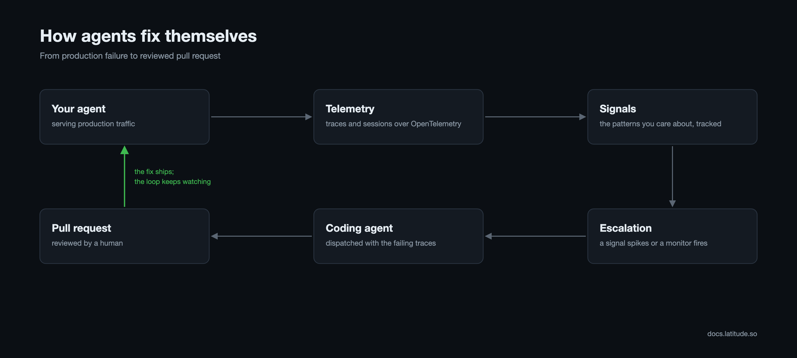

# How we built a system for agents to fix themselves

A few weeks ago, a developer pushed a refactor touching one of the agents Latitude runs in production. It looked harmless in review. Every request kept going through and latency stayed flat, but the prompt cache hit rate (how often an AI successfully reuses its cache instead of rereading information), which is normally above 80 percent, fell to 30. For perspective, cache reads cost about a tenth of what fresh input tokens do, so the drop tripled our effective token spend on the same traffic.

Thankfully, a monitor in Latitude was watching that rate and the drop opened an incident which, in turn, dispatched Claude Code in the cloud, and a few minutes later a pull request appeared that restored the cache structure the refactor had broken. A developer reviewed the change, merged it, and the hit rate recovered within the hour.

Without that loop, a regression like this tends to pop up weeks later in a cost report, and someone spends an afternoon dissecting deploys to find it. Latitude was built around the idea that the system watching an agent should be able to hand its evidence to the system that writes the fix.

This is the loop:



It is not one feature, and none of it has to be adopted at once. Here is how to wire it up for your own agent, in the order that each step starts paying for itself. Latitude is MIT-licensed, so every step can be checked against the code.

## Step 1: Instrument the agent

The loop can only act on what it can see, so everything starts with telemetry. Point your agent's OpenTelemetry exporter at Latitude and every interaction starts flowing in as a trace, carrying the model calls, tool calls, retrieved context, latency, and cost. Related traces group into sessions, so a ten-turn conversation is a single object rather than ten disconnected rows. If your agent emits OpenTelemetry today, this is a new endpoint rather than a rewrite.

## Step 2: Find a failure worth fixing

With traffic flowing, go looking. Search works over everything your agent has done, by meaning rather than keywords, so "users frustrated with checkout" or "refunds where the agent quoted a number" returns the conversations that match. The reason Latitude can afford to cover all of your traffic rather than a sample is that agent traffic is mostly repetition. The same system prompt, tool output, and templated response recur thousands of times a day, so each unique message is embedded once no matter how many traces contain it, and full coverage costs about as much as a sample would.

For the patterns you would not think to search for, Behaviors cluster sessions by what the user was trying to do and arrange them into a hierarchy of topics, each with a trend computed from the last day of traffic against the week before it. When password-reset loops start spiking, the change shows up as a status before anyone has gone looking for it.

Pick the failure that hurts most. For this walkthrough, say your support agent keeps quoting wrong refund amounts.

## Step 3: Annotate what you find

Open a failing trace and say so. A thumbs-down with specific feedback ("quoted 30 dollars, the order history says 45") is the strongest signal you can give the system. Do this for a handful of cases as you find them; these annotations become the ground truth everything downstream is built on, and automatic flaggers do the same job for common failure categories without waiting for a human.

## Step 4: Let the annotations become a Signal

You do not have to organize your annotations. When a new one arrives, discovery compares it against the Signals that already exist and either files it under one or creates a new Signal with a generated name. Ten annotations from three teammates over two weeks converge on a single `wrong_refund_amount` Signal instead of remaining ten disconnected pieces of feedback.

A Signal is any pattern you want to follow across production, with a recurring failure being the common case. Unlike a saved search, it is a durable entity with a name, a description, members, and a lifecycle. A Signal is new for its first week, escalating while its counts are above normal, and ongoing otherwise, and if a pattern goes quiet and comes back later, the same detection escalates it again.

## Step 5: Give the Signal an evaluation

An evaluation is a small script that scores live traffic for the Signal, and it can mix three kinds of rules in whatever combination fits the pattern: plain code checks (text matches, tool failures, output shape), semantic similarity against a phrase, and LLM judgment for the parts that need actual reading. Simple ones come from a criteria prompt or a set of conditions, and the advanced path is writing the script yourself.

For Signals born from annotations, Latitude can also generate the script. GEPA, an evolutionary optimizer, uses your annotations as examples, tests script variants against them, and keeps the one that agrees with the human verdicts most, with cost and latency as tiebreakers. Judges optimized this way carry their agreement record, so how often the script scores the way a person would is a measured number rather than an assumption. From then on the evaluation runs on every new trace, and its verdicts keep the Signal current.

## Step 6: Turn on dispatch

Escalation is judged against the Signal's own history, the last day of occurrences compared with the same hours over the week before, so a pattern that is growing stands out from ordinary daily rhythm. Monitors extend the same idea to anything else you care about, a saved search or a raw traffic metric, which is how the cache-hit-rate drop in the opening reached a coding agent within minutes of the deploy.

Dispatch is configured per project under Settings → Integrations, and the targets are Claude Code, Cursor, Linear, or a webhook. When a Signal escalates or a monitor opens an incident, the chosen agent is woken with a small payload, a prompt, a deep link, and examples of the failing traffic. Latitude is the trigger and the context provider rather than the agent runtime. The dispatched agent runs in your environment, with your credentials, against your repository, where it investigates the way an engineer would, reading the Signal and its trend, slicing occurrences to find where they concentrate, and reading the failing conversations. Then it fixes the agent's code or prompts, runs the project's checks, and opens a pull request.

## Step 7: Lock the fix in CI

The regression test the agent writes lives in your repository, not in Latitude. The failing traffic behind the Signal becomes a dataset, the test replays that dataset against the agent, and your CI runs it as an ordinary check on every pull request from then on. The fix has to pass it to merge, and so does every prompt change that comes after.

In the repository of Latitude's own support agent, the first attempted fix failed the regression check on its pull request, and only the second, which cleared the replayed traces, went in. The monitor keeps watching live traffic in the meantime, and if the failure returns, the Signal escalates again.

## Where you stay in the loop

Humans remain in two places by design. Annotations are the ground truth every evaluation is optimized against, and a person reviews every pull request before it merges. Everything between those two points, the example-hunting, the context reconstruction, the judgment call about whether a failure is recurring, the trace ids carried from a dashboard into a ticket into an editor, is what got automated.

A failure that would once have become a ticket in someone's backlog now arrives as a pull request waiting for review.

## Start the loop

Steps 1 through 3 take an afternoon, and each step pays for itself before the next one starts. Latitude is MIT-licensed, self-hostable, and the whole workspace is exposed over MCP:

```bash
claude mcp add --transport http latitude https://api.latitude.so/v1/mcp
```

[Github Repo](https://github.com/latitude-dev/latitude-llm)
