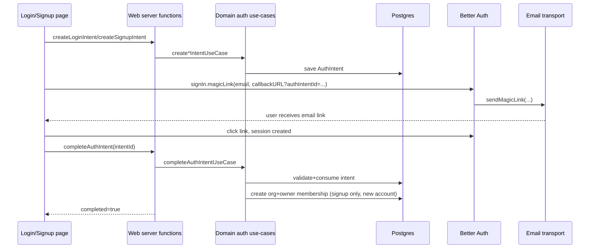

# Authentication Overview

This project uses **Better Auth** for sessions/providers and a domain-level **Auth Intent** model for magic-link flows.

## TL;DR

- Better Auth is mounted at `/api/auth/$` in `apps/web/src/routes/api/auth/$.ts`.
- Browser auth client uses `/api/auth` via `apps/web/src/lib/auth-client.ts`.
- Magic-link login/signup always starts by creating an `AuthIntent` in domain code.
- After sign-in, `/` completes the intent (provisioning org/membership for new signup).

## Core Model

```mermaid
classDiagram
  class AuthIntent {
    +id: string
    +type: login|signup|invite
    +email: string
    +data.signup?: {name, organizationName}
    +existingAccountAtRequest: boolean
    +expiresAt: Date
    +consumedAt: Date|null
    +createdOrganizationId: string|null
  }

  class User {
    +id: string
    +email: string
    +name?: string
  }

  class Organization {
    +id: string
    +name: string
    +creatorId: string
  }

  class Membership {
    +id: string
    +organizationId: string
    +userId: string
    +role: owner|admin|member
  }

  User "1" --> "0..*" AuthIntent : requests
  AuthIntent "0..1" --> "1" Organization : creates on signup
  User "1" --> "0..*" Membership : owns/joins
  Organization "1" --> "0..*" Membership : has
```

## Magic-Link Flow



## What Happens On Each Route

- `apps/web/src/routes/login.tsx`
  - Creates **login intent** first.
  - Calls Better Auth magic-link sign-in with callback containing `authIntentId`.
- `apps/web/src/routes/signup.tsx`
  - Creates **signup intent** first (captures `name` + `organizationName`).
  - Calls Better Auth magic-link sign-in with callback containing `authIntentId`.
- `apps/web/src/routes/index.tsx`
  - On page load, reads `authIntentId` and calls `completeAuthIntent`.

## Where Business Rules Live

- Domain use-cases: `packages/domain/auth/src/use-cases/*`
  - `create-login-intent.ts`
  - `create-signup-intent.ts`
  - `complete-auth-intent.ts`
- Intent policy helpers: `packages/domain/auth/src/use-cases/auth-intent-policy.ts`
- Postgres adapters:
  - `packages/platform/db-postgres/src/repositories/auth-intent-repository.ts`
  - `packages/platform/db-postgres/src/repositories/auth-user-repository.ts`
  - schema: `packages/platform/db-postgres/src/schema/auth-intent.ts`

## Better Auth Composition

- Factory: `packages/platform/auth-better/src/index.ts`
- App wiring: `apps/web/src/server/clients.ts`
- Enabled features today:
  - Email/password
  - Magic links
  - Social providers (Google/GitHub when env vars exist)
  - Organizations plugin
