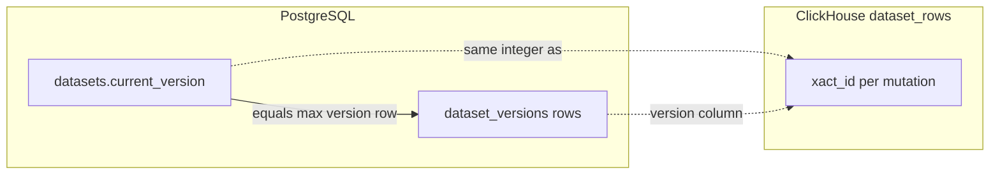

# Dataset versioning: Postgres metadata vs ClickHouse row storage

This document explains how **`dataset_versions`** relates to **`datasets`** in PostgreSQL, and how those version numbers drive **`dataset_rows`** in ClickHouse.

## Mental model

- **Postgres** holds the dataset’s **control plane**: identity, `current_version`, and one **`dataset_versions`** row per committed version (stats, source, stable IDs).
- **ClickHouse** holds the **row payload** as an **append-only** log keyed by a numeric **`xact_id`** that must stay aligned with Postgres **`current_version`** / **`dataset_versions.version`**.
- The **numeric version** (`1`, `2`, `3`, …) is the bridge. The **version row id** (`DatasetVersionId`, a CUID) exists in Postgres only; reads that need “version N” either use the number directly or **resolve** a `versionId` to that number.



## PostgreSQL: `datasets` and `dataset_versions`

### `datasets`

Defined in `packages/platform/db-postgres/src/schema/datasets.ts`. Relevant fields:

| Column           | Role |
|------------------|------|
| `id`             | Dataset primary key |
| `current_version`| Monotonic counter of committed versions (starts at `0`) |

There is **no foreign key** from `dataset_versions` to `datasets` (repository convention: referential integrity in the app layer).

### `dataset_versions`

Defined in `packages/platform/db-postgres/src/schema/datasetVersions.ts`:

| Column          | Role |
|-----------------|------|
| `id`            | Stable **`DatasetVersionId`** (CUID) returned to clients after mutations |
| `dataset_id`    | Which dataset this version belongs to |
| `version`       | Integer matching the dataset’s version **number** after that commit (unique per dataset with `dataset_id`) |
| `rows_inserted` / `rows_updated` / `rows_deleted` | Aggregated stats for that commit |
| `source`        | e.g. `api`, `web`, `traces`, `seed` |
| `actor_id`      | Optional actor |

**Uniqueness:** `(dataset_id, version)` is unique, so each version number has at most one metadata row.

### How they stay in sync

1. **`datasets.current_version`** is the **head** version number.
2. When listing or loading a dataset, **`latestVersionId`** is the `dataset_versions.id` whose **`version`** equals **`datasets.current_version`** (left join in `DatasetRepositoryLive`).

So: **`current_version` is the number; `dataset_versions` stores the extra metadata and a stable id for that number.**

## When versions are created and rolled back

Domain use-cases call **`DatasetRepository.incrementVersion`** before writing to ClickHouse, and **`decrementVersion`** if the ClickHouse write fails (compensating transaction).

Typical flow (see `packages/domain/datasets/src/use-cases/insert-rows.ts`):

1. **`incrementVersion`** (repository):
   - `UPDATE datasets SET current_version = current_version + 1`
   - `INSERT` into `dataset_versions` with the new `version` number and stats
   - Returns a **`DatasetVersion`** including **`id`** (`versionId`) and **`version`** (number)
2. ClickHouse operations use **`version.version`** as **`xact_id`** for new rows.
3. On failure: **`decrementVersion`** deletes the `dataset_versions` row by `versionId` and decrements `current_version` (floored at `0`).

Mutations that bump versions include **insert rows**, **update row**, **delete rows** (and flows that delegate to `insertRows`, e.g. **add traces to dataset**).

## Resolving `versionId` → number for reads

Use-cases such as **`listRows`**, **`countRows`**, and **`getRowDetail`** accept an optional **`versionId`**. If present, they call **`DatasetRepository.resolveVersion`**, which loads **`dataset_versions.version`** for that id and dataset. That **numeric** value is passed to ClickHouse as the **version filter**.

If **`versionId` is omitted**, ClickHouse queries do **not** add `xact_id <= …`; **`argMax(..., xact_id)`** still returns the **latest** state as of the highest `xact_id` seen for each `row_id`.

## ClickHouse: `dataset_rows` and `xact_id`

Schema: `packages/platform/db-clickhouse/clickhouse/migrations/unclustered/00003_create_dataset_rows.sql`.

| Concept | Column / behavior |
|---------|-------------------|
| Version number | **`xact_id` (`UInt64`)** — documented in-migration as matching Postgres **`current_version`** |
| Identity | `(organization_id, dataset_id, row_id)`; multiple physical rows per logical row over time |
| Latest value | **`argMax(column, xact_id)`** per `row_id` |
| Deletes | New row with **`_object_delete = true`** at the delete’s **`xact_id`** |
| Point-in-time | **`WHERE xact_id <= {version}`** so only mutations up to that version participate in `argMax` |

Implementation: `packages/platform/db-clickhouse/src/repositories/dataset-row-repository.ts`

- **`buildVersionClause`:** `version !== undefined` → `AND xact_id <= {version:UInt64}`
- **Inserts:** `insertBatch` sets `xact_id: args.version` (the Postgres version number from `incrementVersion`)
- **Updates:** new insert row with new payload and **`xact_id`** = new version
- **Deletes:** batch insert tombstone rows with **`_object_delete: true`** and **`xact_id`** = delete version
- **Domain row `version`:** mapped from **`max(xact_id)`** / **`latest_xact_id`** in query results

So **Postgres `dataset_versions.version` and ClickHouse `xact_id` are the same integer sequence** for a dataset, maintained by always incrementing in Postgres **before** appending ClickHouse rows for that mutation.

## End-to-end example

1. Dataset created: `current_version = 0`, no `dataset_versions` row yet for “version 0” as a committed snapshot in the same way (first real commit is typically version `1` when rows are inserted).
2. First **`insertRows`**: `incrementVersion` → `current_version = 1`, new **`dataset_versions`** row with `version = 1`, **`rowsInserted = n`**. ClickHouse rows inserted with **`xact_id = 1`**.
3. **List without `versionId`:** CH returns latest **`argMax`** per row (here, state at `xact_id` 1).
4. **List with `versionId`** pointing to that row: **`resolveVersion`** → `1`, query uses **`xact_id <= 1`** — same snapshot.
5. **Update:** `incrementVersion` → `current_version = 2`, new CH row for that **`row_id`** with **`xact_id = 2`**. Listing at **`versionId` for version 1** still shows the old payload; listing latest shows version **2**.

## ClickHouse storage lifecycle

**Old version rows are kept forever.** The table uses a plain `MergeTree()` engine with no `TTL` clause, no `ReplacingMergeTree` deduplication, and no background cleanup job. Every insert, update, and delete appends physical rows that remain indefinitely.

This is intentional: `argMax(..., xact_id)` needs all historical rows to resolve the latest state, and pinned reads (`xact_id <= N`) need old versions to reconstruct past snapshots. But it means **storage grows linearly with every mutation**, not just with the current row count.

Possible future mitigation strategies:

- **`ReplacingMergeTree(xact_id)`** — ClickHouse merges duplicate `row_id` entries in the background, keeping only the highest `xact_id`. Saves space but **breaks point-in-time reads** since old versions disappear after compaction.
- **TTL on old versions** — e.g. `TTL created_at + INTERVAL 90 DAY` to age out rows older than a retention window while keeping recent history.
- **Application-level compaction job** — a worker that keeps only the latest `xact_id` row per `row_id` (and optionally the `N` most recent), deleting the rest via `ALTER TABLE ... DELETE`. Preserves point-in-time for recent versions while reclaiming space from ancient ones.

## Retention policy for free accounts (design sketch)

The subscription system already models plan tiers (`HobbyV3`, `TeamV4`, `ScaleV1`, `EnterpriseV1`) in `@domain/subscriptions` with per-plan quotas (seats, runs, credits). A dataset version retention policy would extend this by adding a **plan-scoped version history limit** — free/Hobby accounts keep fewer historical versions than paid tiers.

### Approach: application-level compaction worker

A new **scheduled worker** (BullMQ repeatable job in `apps/workers`) would periodically compact old dataset row versions in ClickHouse based on the owning organization's plan.

**Step 1 — Add retention config to `PlanConfig`** (`packages/domain/subscriptions/src/entities/plan.ts`):

```typescript
export interface PlanConfig {
  // ...existing fields...
  readonly datasetVersionRetention: number | null // max versions to keep per dataset; null = unlimited
}
```

Example values:

| Plan | `datasetVersionRetention` |
|------|---------------------------|
| HobbyV3 | `5` |
| TeamV4 | `50` |
| ScaleV1 | `200` |
| EnterpriseV1 | `null` (unlimited) |

**Step 2 — Compaction use-case** (`@domain/datasets`):

For a given `(organizationId, datasetId)`:

1. Read `datasets.current_version` (the head version number).
2. Resolve the organization's plan via `SubscriptionRepository.findActive()` → `plan.datasetVersionRetention`.
3. Compute the **cutoff version** = `current_version - retention`.
4. If `cutoff > 0`:
   - **ClickHouse:** `ALTER TABLE dataset_rows DELETE WHERE organization_id = {org} AND dataset_id = {ds} AND xact_id <= {cutoff}`, then re-insert a single "compacted" row per `row_id` with `xact_id = cutoff` holding the resolved state at that point. This preserves `argMax` correctness for versions > cutoff.
   - **Postgres:** delete `dataset_versions` rows where `version <= cutoff`.

Alternatively, if point-in-time for retained versions isn't needed, the simpler path:

1. For each `row_id`, keep only the row with `max(xact_id)` and delete all others.
2. Delete all `dataset_versions` except the current one.

This loses all history but maximally reclaims space for free accounts.

**Step 3 — Worker scheduling** (`apps/workers`):

A BullMQ repeatable job runs on a cron schedule (e.g. daily). For each organization on a capped plan:

1. List all datasets for the organization.
2. For each dataset where `current_version > retention`, run the compaction use-case.

This follows the existing worker pattern (see `apps/workers/src/server.ts`): BullMQ config, a queue consumer, and a domain use-case handler.

### What changes at write time

Nothing at write time. The append-only insert/update/delete flow stays unchanged. Compaction runs **asynchronously** and eventually reclaims space. Reads for compacted versions return "version not found" from `resolveVersion`, which already fails with `DatasetNotFoundError` — the UI/API can surface this as "this version has been archived."

### What changes at read time

If a `versionId` resolves to a version number that has been compacted away (its `dataset_versions` row was deleted), `resolveVersion` returns a `DatasetNotFoundError`. The client would need to handle this gracefully — e.g. "This version is no longer available on your plan."

### Alternative: ClickHouse TTL per-partition

ClickHouse `TTL` clauses operate on the entire table and cannot be conditioned on external state (like an organization's plan). Per-organization TTLs would require partitioning changes or separate tables per tier, which adds significant complexity. The application-level compaction approach is simpler and aligns with the existing architecture.

## Caveats (from domain code)

- **`update-row.ts`** documents that concurrent updates can race on the version number (last-write-wins at the same `xact_id` in extreme races); **`argMax`** may be non-deterministic if two writers somehow used the same version — mitigated in normal use by sequential `incrementVersion` per request.
- **`decrementVersion`** removes the Postgres version row and steps `current_version` back; ClickHouse rows written for that version **remain** (orphan `xact_id`s). Future **`argMax`** ignores them for “latest” if a higher `xact_id` exists; if you listed at the rolled-back version number, behavior depends on whether any later mutation occurred. This path is intended for **failed writes** right after bump, not general “undo.”

## File index

| Area | Location |
|------|----------|
| Schema `dataset_versions` | `packages/platform/db-postgres/src/schema/datasetVersions.ts` |
| Schema `datasets` | `packages/platform/db-postgres/src/schema/datasets.ts` |
| Increment / decrement / resolve | `packages/platform/db-postgres/src/repositories/dataset-repository.ts` |
| Domain types | `packages/domain/datasets/src/entities/dataset.ts` |
| Use-cases | `packages/domain/datasets/src/use-cases/*.ts` (e.g. `insert-rows`, `update-row`, `delete-rows`, `list-rows`, `count-rows`, `get-row-detail`) |
| ClickHouse table DDL | `packages/platform/db-clickhouse/clickhouse/migrations/unclustered/00003_create_dataset_rows.sql` |
| ClickHouse repository | `packages/platform/db-clickhouse/src/repositories/dataset-row-repository.ts` |
| Plans and quotas | `packages/domain/subscriptions/src/entities/plan.ts` |
| Organization quota | `packages/domain/subscriptions/src/use-cases/get-organization-quota.ts` |
| Workers entry point | `apps/workers/src/server.ts` |
