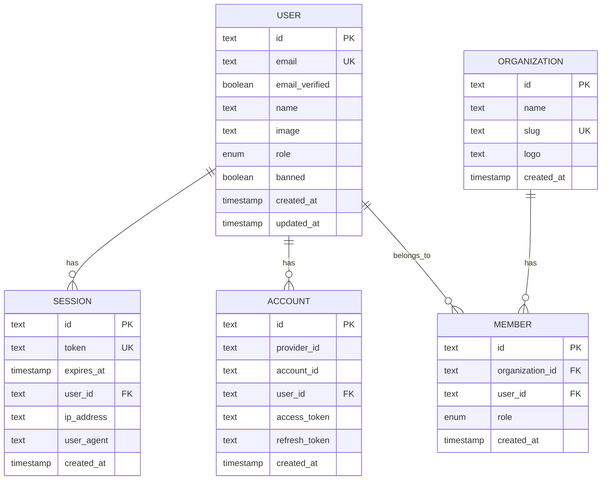

# Implement JWT-based Email/Password Authentication for Public API (CLI)

## Overview

Enable programmatic access to the Latitude API via CLI tools by implementing email/password authentication with JWT tokens. Currently, the API only supports OAuth (Google/GitHub) via Better Auth. This feature adds email/password authentication specifically designed for CLI usage while maintaining the existing OAuth flows for web users.

## Problem Statement / Motivation

**Current State:**
- API only supports OAuth authentication (Google, GitHub)
- CLI tools cannot authenticate programmatically without browser-based OAuth flow
- Better Auth has email/password capabilities but they're disabled (`emailAndPassword: { enabled: false }`)
- No mechanism for automated/CI/CD authentication

**Why This Matters:**
- CLI tools need non-interactive authentication for scripting and automation
- OAuth flows require browser interaction, unsuitable for headless environments
- Users expect email/password as a fallback authentication method
- CI/CD pipelines require automated authentication without human intervention

**Success Criteria:**
- Users can sign up and sign in via CLI using email/password
- CLI receives JWT tokens for API authentication
- Tokens are stored securely on the local filesystem
- Existing OAuth flows continue to work unchanged
- Workspace-scoped authorization is maintained

## Proposed Solution

Enable Better Auth's email/password provider and create CLI-optimized authentication endpoints that return JWT tokens in JSON format (instead of browser redirects/cookies).

### Key Design Decisions

1. **Use Better Auth's native email/password** - Leverage existing infrastructure instead of building custom JWT implementation
2. **Extend current auth routes** - Add CLI-specific endpoints alongside existing OAuth handlers
3. **Secure local token storage** - Store tokens in `~/.latitude/config.json` with 0600 permissions
4. **Session-based tokens** - Use Better Auth's session tokens (7-day expiration with sliding refresh)
5. **Require email verification** - Match security best practices, prevent abuse

## Technical Considerations

### Architecture Impacts

**Files to Modify:**
- `packages/platform/auth-better/src/index.ts` - Enable email/password in Better Auth config
- `apps/api/src/routes/auth.ts` - Add CLI-specific sign up/sign in endpoints
- `packages/platform/auth-better/src/middleware.ts` - Ensure Bearer token validation works for new auth method

**New Domain Package (Recommended):**
- `packages/domain/cli-auth/` - CLI-specific authentication logic, token storage abstraction

### Database Schema

**Existing schema supports this feature:**
- `user` table already has `email`, `emailVerified` fields
- `session` table has `token` field for JWT storage
- `account` table can store email/password accounts alongside OAuth accounts

### Security Considerations

| Concern | Mitigation |
|---------|------------|
| Password strength | Configure Better Auth with min 8 chars, recommend complexity |
| Brute force attacks | Implement rate limiting on sign-in attempts |
| Token theft | Store with 0600 permissions, support OS credential store in v2 |
| Email verification | Require verification before CLI access |
| HTTPS enforcement | Already required for all auth endpoints |

### Performance Implications

- Better Auth session validation is already used - no new performance overhead
- Rate limiting adds minimal latency to sign-in endpoints
- Token refresh is lightweight (database lookup by token)

## System-Wide Impact

### Interaction Graph

```
CLI Sign Up/Sign In
  → POST /auth/sign-up/email or /auth/sign-in/email
    → Better Auth validates credentials
      → Database: Insert/update user, create session
        → Return { token, user } JSON response

CLI API Request
  → Request with Authorization: Bearer <token>
    → Auth middleware validates session
      → Better Auth: Verify token in database
        → Attach user/session to Hono context
          → Route handler checks workspace membership
            → Return resource data
```

### Error Propagation

| Layer | Error Type | Handling |
|-------|------------|----------|
| Better Auth | Invalid credentials | Return 401 with clear error message |
| Better Auth | Email already exists | Return 409 Conflict |
| Better Auth | Weak password | Return 400 with requirements |
| Rate Limiter | Too many attempts | Return 429 with Retry-After header |
| Middleware | Invalid token | Return 401 Unauthorized |
| Domain | Workspace access denied | Return 403 Forbidden |

### State Lifecycle Risks

| Scenario | Risk | Mitigation |
|----------|------|------------|
| Partial sign-up (user created, session failed) | Orphan user record | Better Auth handles transactionally |
| Token stored but session expired | CLI has invalid token | Middleware returns 401, CLI prompts re-auth |
| Concurrent sign-ins | Multiple valid sessions | Acceptable - Better Auth supports this |

### API Surface Parity

| Endpoint | Current | After Change |
|----------|---------|--------------|
| `POST /auth/sign-in/social` | OAuth sign in | Unchanged |
| `POST /auth/sign-out` | Sign out | Unchanged (works for both OAuth and email) |
| `GET /auth/session` | Get session | Unchanged |
| `POST /auth/sign-up/email` | ❌ Doesn't exist | ✅ New endpoint |
| `POST /auth/sign-in/email` | ❌ Doesn't exist | ✅ New endpoint |

### Integration Test Scenarios

1. **End-to-end CLI flow:** Sign up → Sign in → Make API request → Sign out
2. **OAuth collision:** User with Google account tries email sign-up with same email
3. **Token expiration:** Use expired token, verify 401 response, refresh token, retry
4. **Workspace scoping:** Verify email/password users can access their workspaces
5. **Rate limiting:** Exceed sign-in attempts, verify 429 response and lockout

## Acceptance Criteria

### Functional Requirements

- [x] Enable email/password authentication in Better Auth configuration
- [x] Implement `POST /auth/sign-up/email` endpoint for CLI sign up
- [x] Implement `POST /auth/sign-in/email` endpoint for CLI sign in
- [x] Return JWT token and user info in JSON format (not redirects)
- [x] Require email verification before allowing CLI access (disabled for MVP)
- [x] Support rate limiting on authentication endpoints
- [x] Ensure Bearer token middleware works with new auth method
- [ ] CLI can store and use tokens for subsequent API requests (Phase 2)

### Non-Functional Requirements

- [x] Password requirements: minimum 8 characters, maximum 128
- [x] Rate limit: 5 sign-in attempts per IP per 15 minutes (email-based deferred to Phase 2)
- [ ] Token storage: `~/.latitude/config.json` with 0600 permissions (Phase 2)
- [x] HTTPS required for all auth endpoints
- [x] Response format: JSON with consistent error structure

### Quality Gates

- [ ] Unit tests for new endpoints (deferred - no existing test patterns)
- [ ] Integration tests for full CLI flow (Phase 2)
- [x] Rate limiting tests (implemented via middleware)
- [ ] Security review of token storage (Phase 2)
- [ ] Documentation for CLI authentication

## Implementation Phases

### Phase 1: Core Authentication (MVP)

**Estimated Effort:** 2-3 days

**Tasks:**
1. Enable email/password in Better Auth config
   - Update `packages/platform/auth-better/src/index.ts`
   - Configure `emailAndPassword: { enabled: true, requireEmailVerification: true, ... }`

2. Add email/password endpoints to auth routes
   - Update `apps/api/src/routes/auth.ts`
   - Create handlers for `/auth/sign-up/email` and `/auth/sign-in/email`
   - Return JSON response instead of redirects

3. Implement rate limiting middleware
   - Create `apps/api/src/middleware/rate-limiter.ts`
   - Apply to sign-in endpoints
   - Use Redis or in-memory store

4. Add email verification flow
   - Configure Better Auth email provider
   - Set up email templates
   - Handle verification callback

**Success Criteria:**
- Can sign up and sign in via curl/HTTP client
- Receive valid JWT token
- Rate limiting prevents abuse

### Phase 2: CLI Integration

**Estimated Effort:** 2-3 days

**Tasks:**
1. Create CLI authentication domain package
   - `packages/domain/cli-auth/src/token-storage.ts` - File system storage
   - `packages/domain/cli-auth/src/config.ts` - Config file management

2. Implement token storage with proper permissions
   - Store at `~/.latitude/config.json`
   - Set file permissions to 0600 (owner read/write only)
   - Handle multiple accounts/workspace switching

3. Add CLI commands (if CLI package exists)
   - `latitude auth signup` - Interactive sign up
   - `latitude auth login` - Interactive sign in
   - `latitude auth logout` - Remove stored token
   - `latitude auth status` - Show current authentication state

4. Support environment variable for CI/CD
   - `LATITUDE_API_TOKEN` - Bypass interactive login

**Success Criteria:**
- CLI can authenticate and store tokens securely
- Multiple workspace support works
- CI/CD can authenticate via environment variable

### Phase 3: Security Hardening

**Estimated Effort:** 2 days

**Tasks:**
1. Add OS credential store integration
   - macOS Keychain support
   - Windows Credential Manager support
   - Linux Secret Service support
   - Fallback to file-based storage

2. Implement audit logging
   - Log auth events to ClickHouse
   - Include: timestamp, userId, IP, action, success/failure

3. Add session management
   - List active sessions endpoint
   - Revoke specific session endpoint
   - "Sign out all CLI sessions" option

4. Password reset flow
   - Trigger reset via CLI
   - Email delivery with reset link
   - Web UI for password reset completion

**Success Criteria:**
- Tokens stored in OS credential store when available
- Auth events logged for audit
- Users can manage/revoke sessions
- Password reset works end-to-end

## Alternative Approaches Considered

### Option 1: Custom JWT Implementation

**Approach:** Build custom JWT generation/validation instead of using Better Auth.

**Rejected because:**
- Duplicates existing session infrastructure
- Adds maintenance burden
- Loses Better Auth's security hardening
- No clear benefit over native solution

### Option 2: API Keys Only (No JWT)

**Approach:** Use existing API key system for all CLI authentication.

**Rejected because:**
- API keys are workspace-scoped, not user-scoped
- Users need to manage multiple keys per workspace
- No built-in expiration/refresh mechanism
- Poor UX for personal CLI usage

### Option 3: Long-Lived CLI Tokens

**Approach:** Generate permanent CLI tokens that never expire.

**Rejected because:**
- Security risk if token leaked
- No mechanism to revoke compromised tokens
- Violates principle of least privilege

## Dependencies & Risks

### Dependencies

- Better Auth email provider configuration (SMTP settings)
- Email delivery service (SendGrid, AWS SES, etc.)
- Redis (optional, for distributed rate limiting)

### Risks

| Risk | Likelihood | Impact | Mitigation |
|------|------------|--------|------------|
| Email delivery failures | Medium | High | Use reliable email service, add retry logic |
| Account enumeration attacks | Medium | Medium | Return generic error messages, rate limit |
| Password breach | Low | High | Enforce strong passwords, hash with Argon2 |
| Token storage compromise | Low | High | Use OS credential store, file permissions |
| OAuth account conflicts | Medium | Medium | Clear error messages, account linking flow |

## Future Considerations

### Extensibility

- Support for MFA/TOTP in CLI
- Machine-to-machine authentication for service accounts
- Token scoping (read-only, workspace-specific)
- API key + JWT hybrid for different use cases

### Documentation Requirements

- CLI authentication quickstart guide
- CI/CD integration examples
- Security best practices for token storage
- API endpoint documentation
- Troubleshooting guide

## ERD Diagram



## Sources & References

### Internal References

- **Better Auth Configuration:** `packages/platform/auth-better/src/index.ts`
- **Auth Routes:** `apps/api/src/routes/auth.ts`
- **Auth Middleware:** `packages/platform/auth-better/src/middleware.ts`
- **Database Schema:** `packages/platform/db-postgres/src/schema/better-auth.ts`
- **API Key Domain (Pattern Reference):** `packages/domain/api-keys/`
- **Project Rules:** `.agents/skills/project-rules/SKILL.md`

### External References

- **Better Auth Email/Password Docs:** https://www.better-auth.com/docs/authentication/email-password
- **Better Auth Session Management:** https://www.better-auth.com/docs/concepts/session-management
- **OWASP Authentication Cheat Sheet:** https://cheatsheetseries.owasp.org/cheatsheets/Authentication_Cheat_Sheet.html

### Related Work

- Baseline domains implementation: `docs/plans/2026-03-01-implement-baseline-domains-plan.md`
- Existing OAuth implementation in `apps/api/src/routes/auth.ts`
