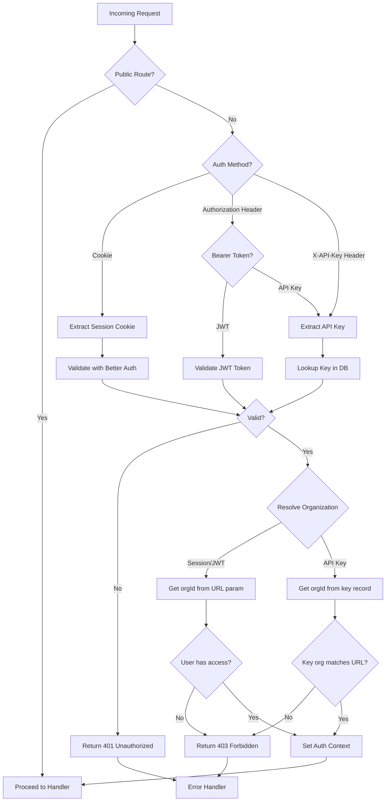

# Implement Authentication Middleware for API Routes

## Overview

Implement unified authentication middleware for apps/api that supports three authentication methods:
1. **Cookie-based sessions** (Better Auth) - for browser-based clients
2. **JWT Bearer tokens** (Better Auth) - for CLI/API clients  
3. **API Keys** - for programmatic service-to-service access

The middleware will extract credentials from requests, validate them, and set an authentication context (userId, organizationId) on the Hono context for downstream handlers.

## Problem Statement / Motivation

Currently, API routes use placeholder functions for extracting user IDs:
- `apps/api/src/routes/organizations.ts:25` - `const getCurrentUserId = () => "user-id-placeholder"`

This means:
- No actual authentication is enforced on protected routes
- Any request can access any organization's data (security vulnerability)
- API keys exist in the database but are not validated
- Multi-tenancy boundaries are not enforced at the API layer

## Proposed Solution

Create an authentication middleware that:
1. Runs on all routes except explicitly public ones
2. Attempts to authenticate via cookie → JWT Bearer → API Key (in that priority order)
3. Sets auth context on Hono's context variable map
4. Integrates with existing Better Auth session management
5. Validates API keys against the database (checking `deletedAt` for revocation)
6. Enforces organization scoping (URL param must match user's membership or API key scope)

### Authentication Priority

When multiple credentials are provided, the middleware validates in this order:
1. **Cookie Session** - Best for browser clients (most secure, HttpOnly)
2. **JWT Bearer Token** - For CLI tools and API clients
3. **API Key** - For service-to-service automation

Only the first valid method is used; if multiple are provided, the first valid one wins.

### Organization Context Resolution

**For Session/JWT Authentication:**
- Organization ID comes from the URL path parameter (`:organizationId`)
- Middleware validates the authenticated user has membership in that organization
- Returns 403 Forbidden if user doesn't belong to the organization

**For API Key Authentication:**
- Organization ID is embedded in the API key record
- URL organization parameter must match the API key's organization
- Returns 403 Forbidden if organization mismatch

## Technical Considerations

### Architecture



### Integration Points

| Component | Integration | File |
|-----------|-------------|------|
| Better Auth | `auth.api.getSession()` for cookie validation | `packages/platform/auth-better/src/index.ts` |
| API Key Repository | `findByToken()` and `touch()` methods | `packages/domain/api-keys/src/ports/api-key-repository.ts` |
| Organization Membership | Verify user belongs to organization | Via Better Auth organization plugin |
| Error Handler | `UnauthorizedError` and `PermissionError` | `packages/domain/shared-kernel/src/errors.ts:52-71` |
| Hono Context | Extend with auth variables | `c.set('auth', {...})` pattern |

### Public Routes (Skip Auth)

- `GET /health` - Health check endpoint
- `POST /v1/auth/sign-up/email` - User registration
- `POST /v1/auth/sign-in/email` - User login
- `POST /v1/auth/sign-in/social` - OAuth sign in
- `POST /v1/auth/sign-in/social/callback` - OAuth callback
- `GET /v1/auth/session` - Get current session (Better Auth handles this)
- `POST /v1/auth/sign-out` - Sign out
- `GET /v1/auth/callback/:provider` - OAuth callback redirect
- All Better Auth internal endpoints (`/v1/auth/*`)

## System-Wide Impact

### Interaction Graph

1. **Request Flow**:
   - `authMiddleware` runs before all protected routes
   - On success: sets `c.set('auth', { userId, organizationId, method })`
   - On failure: throws `UnauthorizedError` → `honoErrorHandler` → 401 response

2. **Better Auth Integration**:
   - Middleware imports Better Auth instance from route handler or creates singleton
   - Uses `auth.api.getSession({ headers: c.req.raw.headers })` for cookie validation
   - Better Auth session cookie is HttpOnly, secure, SameSite=lax

3. **API Key Validation Flow**:
   - Extract key from `X-API-Key` header or `Authorization: Bearer <key>`
   - Query database via `ApiKeyRepository.findByToken()`
   - Check `deletedAt` is null (not revoked)
   - Optionally update `lastUsedAt` via `touch()` (fire-and-forget async)

4. **Organization Scoping Flow**:
   - Extract `organizationId` from URL params (`c.req.param('organizationId')`)
   - For session/JWT: query Better Auth membership API to verify access
   - For API key: compare key's `organizationId` with URL param
   - Mismatch → `PermissionError` → `honoErrorHandler` → 403 response

### Error & Failure Propagation

| Error Type | Source | HTTP Status | Handling |
|------------|--------|-------------|----------|
| `UnauthorizedError` | Missing/invalid credentials | 401 | Returns `{ error: "Authentication required" }` |
| `PermissionError` | Valid credentials, wrong organization | 403 | Returns `{ error: "Access denied to organization" }` |
| `RepositoryError` | Database failure during API key lookup | 500 | Logged, returns generic error |
| Better Auth errors | Invalid session/token | 401 | Propagates from Better Auth |

### State Lifecycle Risks

1. **API Key Soft Delete**:
   - Keys are soft-deleted (set `deletedAt`) not hard-deleted
   - Middleware must check `deletedAt IS NULL` on every validation
   - Risk: Revoked keys could still work if check is missed

2. **Session Expiration**:
   - Better Auth sessions expire after 7 days (configurable)
   - Sessions auto-refresh after 1 day of activity
   - Risk: Expired sessions not detected if Better Auth validation bypassed

3. **Organization Membership Changes**:
   - User removed from organization but still has valid session
   - Risk: Cached session allows access after membership revocation
   - Mitigation: Always check membership on organization-scoped requests

### API Surface Parity

All protected routes will receive auth context via Hono's context:

```typescript
// Hono context extension (in apps/api/src/types.ts or similar)
interface AuthContext {
  readonly userId: UserId
  readonly organizationId: OrganizationId
  readonly method: "cookie" | "jwt" | "api-key"
}

type Variables = {
  auth: AuthContext
}
```

Handlers access auth context via:
```typescript
const auth = c.get('auth')
// No longer need: const getCurrentUserId = () => "user-id-placeholder"
```

### Integration Test Scenarios

1. **Cross-auth-method conflict**: Request with valid cookie AND valid API key → cookie wins, organization from cookie session

2. **Revoked key rejection**: Create API key → revoke it (soft delete) → attempt access → should return 401

3. **Multi-org user isolation**: User in Org A and Org B → session auth → access Org A data succeeds, Org B succeeds, Org C fails with 403

4. **API key org scoping**: API key for Org A → request to `/v1/organizations/Org-B/projects` → 403 Forbidden

5. **Session expiration mid-request**: Valid session at request start → expires during handler execution → Better Auth validation catches it

## Acceptance Criteria

### Functional Requirements

- [ ] Middleware validates cookie sessions via Better Auth
- [ ] Middleware validates JWT Bearer tokens via Better Auth  
- [ ] Middleware validates API keys via database lookup
- [ ] Middleware checks API key `deletedAt` to reject revoked keys
- [ ] Middleware resolves organization from URL parameter for session/JWT auth
- [ ] Middleware validates user membership in organization for session/JWT auth
- [ ] Middleware validates API key organization matches URL parameter
- [ ] Middleware sets auth context on Hono context for downstream handlers
- [ ] Middleware throws `UnauthorizedError` (401) for missing/invalid credentials
- [ ] Middleware throws `PermissionError` (403) for organization access violations
- [ ] Public routes (`/health`, `/v1/auth/*`) skip authentication
- [ ] Route handlers can access auth context via `c.get('auth')`
- [ ] Placeholder `getCurrentUserId()` functions replaced with real context extraction

### Non-Functional Requirements

- [ ] Response time impact < 10ms for authenticated requests
- [ ] No Redis/cache dependency for auth validation (stateless)
- [ ] Middleware compatible with existing error handler
- [ ] Type-safe auth context with TypeScript
- [ ] Works with existing CORS configuration

### Testing Requirements

- [ ] Unit tests for each auth method (cookie, JWT, API key)
- [ ] Unit tests for organization scoping logic
- [ ] Integration tests with real Better Auth instance
- [ ] Integration tests with real database (API key validation)
- [ ] E2E tests for complete request flows

## Implementation Plan

### Phase 1: Core Middleware Structure

**Files to create:**
- `apps/api/src/middleware/auth.ts` - Main authentication middleware
- `apps/api/src/types.ts` - Hono context type extensions

**Key components:**
1. Define `AuthContext` interface with `userId`, `organizationId`, `method`
2. Create Hono middleware factory function
3. Implement credential extraction (cookie, Authorization header, X-API-Key header)
4. Implement validation orchestration (try cookie → JWT → API key)
5. Implement organization scoping logic
6. Wire into error handling system

### Phase 2: Better Auth Integration

**Integration point:**
- Access Better Auth instance from `apps/api/src/routes/auth.ts`
- May need to export auth instance or create singleton pattern

**Implementation:**
- Call `auth.api.getSession()` for cookie validation
- Parse JWT from `Authorization: Bearer <token>` header
- Validate JWT via Better Auth (verify signature, expiration)

### Phase 3: API Key Integration

**Integration points:**
- Import `ApiKeyRepository` from `@platform/db-postgres`
- Use `findByToken()` method to lookup keys
- Use `touch()` method to update `lastUsedAt` (async, fire-and-forget)

**Implementation:**
- Extract key from `X-API-Key` header (primary) or `Authorization: Bearer <key>` (fallback)
- Query database for key record
- Validate key exists and `deletedAt IS NULL`
- Extract `organizationId` from key record

### Phase 4: Organization Scoping

**Implementation:**
- Extract `organizationId` from URL params using existing `extractParam()` utility
- For session/JWT: verify user has membership via Better Auth organization API
- For API key: compare key's org ID with URL param
- Throw `PermissionError` on mismatch

### Phase 5: Route Integration

**Files to modify:**
- `apps/api/src/server.ts` - Apply middleware globally (except public routes)
- `apps/api/src/routes/organizations.ts` - Replace placeholder with real auth
- `apps/api/src/routes/projects.ts` - Add auth context extraction
- `apps/api/src/routes/api-keys.ts` - Add auth context extraction

### Phase 6: Testing

**Test files:**
- `apps/api/src/middleware/auth.test.ts` - Unit tests
- `apps/api/test/auth.e2e.test.ts` - E2E tests (if E2E test structure exists)

## Success Metrics

- [ ] All existing placeholder `getCurrentUserId()` calls replaced
- [ ] No 401/403 errors on public routes (health, auth)
- [ ] 401 returned for requests without credentials to protected routes
- [ ] 403 returned for requests with valid credentials but wrong organization
- [ ] API key validation completes in < 5ms (database lookup)
- [ ] Better Auth validation completes in < 5ms (session lookup)

## Dependencies & Risks

### Dependencies

- Better Auth instance must be accessible from middleware
- API Key repository must have `findByToken()` method available
- Organization membership API from Better Auth for validation

### Risks

| Risk | Impact | Mitigation |
|------|--------|------------|
| Performance degradation | High | Cache API key lookups in memory (TTL 60s) if needed |
| Better Auth API changes | Medium | Pin Better Auth version, monitor changelogs |
| Database connectivity | High | Fail closed (reject auth) on DB errors for API keys |
| Session validation overhead | Low | Better Auth sessions stored in DB, not external call |

## Documentation Plan

- [ ] Update API documentation with authentication requirements
- [ ] Document auth header formats (`Authorization: Bearer <token>`, `X-API-Key: <key>`)
- [ ] Add examples for CLI authentication with JWT
- [ ] Add examples for API key usage
- [ ] Document organization scoping behavior

## Sources & References

### Internal References

- Better Auth configuration: `packages/platform/auth-better/src/index.ts`
- Auth routes (Better Auth integration): `apps/api/src/routes/auth.ts`
- API Key domain: `packages/domain/api-keys/src/`
- API Key repository interface: `packages/domain/api-keys/src/ports/api-key-repository.ts`
- Error types: `packages/domain/shared-kernel/src/errors.ts`
- Route registration: `apps/api/src/routes/index.ts`
- Middleware patterns: `apps/api/src/middleware/rate-limiter.ts`
- Error handler: `apps/api/src/middleware/error-handler.ts`
- Server setup: `apps/api/src/server.ts`

### External References

- Better Auth documentation: https://www.better-auth.com/
- Better Auth session API: https://www.better-auth.com/docs/concepts/session-management
- Hono middleware documentation: https://hono.dev/docs/guides/middleware
- Effect TS error handling: https://effect.website/docs/error-management/expected-errors

### Related Work

- API Key feature: PRs implementing API key domain (already in codebase)
- Better Auth integration: PRs setting up Better Auth (already in codebase)
- JWT email/password auth: `docs/plans/2026-03-01-feat-jwt-email-password-auth-cli-plan.md`
