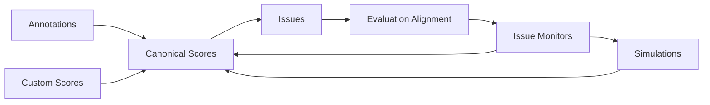

# Reliability

The reliability system is a cross-domain product/system that turns live agent traffic plus human judgment into:

- canonical scores
- discovered issues
- evaluation monitors
- long-term reliability analytics
- simulation-driven pre-ship validation

## Documentation Contract

These docs describe the intended implemented reliability system, not just a temporary snapshot of the code that has already landed.

While the reliability spec is active, some duplication between spec and docs is intentional.

The docs should remain precise enough to stand on their own after the spec is deleted.

## Core Principles

1. Canonical mutable score rows live in Postgres from day one.
2. ClickHouse stores only immutable score projection rows used for analytics.
3. Issue search and clustering projection live in Weaviate.
4. Evaluation artifacts are stored as scripts from day one, even before the full portable runtime exists.
5. The Latitude reliability platform should be equally accessible to humans through the web app UI and to other LLM Agents through MCP/API.
6. Build reliability in `apps/web` first when that improves iteration speed, but design schemas/use-cases and public capabilities so the product does not dead-end into UI-only flows.
7. Canonical reliability domain data contracts are defined as shared Zod schemas first, with TypeScript types inferred from those schemas or the matching Drizzle schemas where appropriate.
8. Shared domain schemas validate data crossing from app/platform boundaries into domain use-cases, while external request/response contracts stay boundary-specific and may reuse or narrow those schemas.
9. Enum-like domain contracts use literal-string unions or `as const` objects, not TypeScript enums.
10. Configurable thresholds, weights, debounce windows, sentinel values, and similar tunables live in named constants inside the owning domain package rather than as scattered inline literals.
11. New reliability tables follow repository conventions: no foreign keys and RLS for organization-scoped Postgres tables.
12. Reliability background work uses the existing queue stack in `@domain/queue`, `@platform/queue-bullmq`, and `apps/workers`, with durable coordination in Postgres rather than in BullMQ job history.

## Legacy V1 References

This documentation keeps explicit legacy references to the old v1 repository.

Those references are paths relative to the repository root of branch `latitude-v1`.

Future coding agents that want to inspect the old implementation should first checkout branch `latitude-v1` in the old repository, then read the cited relative paths from that repository root.

For UI/product-surface work, old v1 components and patterns should also be treated as a reference:

- when this documentation refers to reusable v1 components, it means the old design-system components in `packages/web-ui/src/ds` from the old repository on branch `latitude-v1`
- do not reuse route-specific components from the old `apps/web/src` tree; the reliability entities, route structure, and product workflows have changed too much
- reuse as much as possible when the old design-system implementation is still solid
- do not copy v1 UI blindly; review it critically and improve it to meet v2 conventions, architecture, and quality standards when needed

## Storage Split

| Store      | Responsibility                                                                                                                                   |
| ---------- | ------------------------------------------------------------------------------------------------------------------------------------------------ |
| Postgres   | canonical `scores`, `evaluations`, `issues`, `annotation_queues`, `simulations`, and embedded settings on `organization`, `projects`, and `user` |
| ClickHouse | immutable score projection rows, score rollups, and score-aware span/trace/session analytics                                                     |
| Weaviate   | issue title/description projection plus centroid vector for discovery/search                                                                     |

## Postgres Indexing

Postgres index design is part of the core schema work from day one, not a later optimization pass.

Rules:

- start from real query shapes: tenant scope first, then lifecycle/filter columns, then the dominant sort column
- define the needed secondary indexes in the relevant domain foundation phase together with the table definitions
- express those indexes directly in the Drizzle table model definitions, not only as surrounding prose; single-column `.unique()` constraints may stay inline on the column when that is the clearest shape
- do not add speculative JSONB, array, or text-search indexes when those queries are already served by owner-row primary keys, Weaviate, or ClickHouse

## System Loop

## Domain Layout

Reliability should not become a single `@domain/reliability` package.

Instead, the implementation should be split into direct domains such as:

- `packages/domain/scores`
- `packages/domain/annotations`
- `packages/domain/issues`
- `packages/domain/evaluations`
- `packages/domain/annotation-queues`
- `packages/domain/simulations`

Settings remain attached to their owner domains:

- organization settings stay with organizations/auth
- project settings stay with projects
- user settings stay with users/auth

Provider/model configuration and provider credentials stay embedded inside those owner `settings` JSONB payloads.

External provider integrations required by the system live in platform packages:

- `@platform/ai-vercel` for calling LLMs
- `@platform/ai-voyage` for embeddings and reranking
- `@platform/db-weaviate` for issue projection storage/search

Optimizer abstractions and concrete optimizer implementations live in domain packages:

- `@domain/optimizations` for the optimizer interface/abstraction
- `@platform/op-gepa` for the first GEPA implementation

## Product Surface Implementation Pattern

Use the repository product pattern for reliability surfaces:

- human-facing reliability product pages live in `apps/web`
- server-side reads and writes for those pages live in `apps/web/src/domains/<domain>/*.functions.ts` via `createServerFn`
- reactive client state and optimistic sync live in `apps/web/src/domains/<domain>/*.collection.ts`
- route-specific reliability UI components should live in the route directory's dedicated `-components/` subfolder so route files stay separate from their supporting UI
- only rarely, when a component is genuinely shared across multiple routes, it may live in the shared `apps/web/src/components` folder
- stable public or machine-facing reliability capabilities live in `apps/api/src/routes/*` modules
- `apps/api` must not become the internal backend for `apps/web`; the web product should compose domain use-cases directly

## Background Task Pattern

Reliability background work should use the current repository async rail:

- `@domain/queue` for producer/consumer contracts
- `@platform/queue-bullmq` for BullMQ transport
- `apps/workers` for worker registration, consumers, and pollers
- the outbox consumer plus `domain-events` topic for post-commit fan-out

Rules:

- queue topics are the stable routing identity; BullMQ's per-job `name` is transport detail only
- domain events use PascalCase names such as `TraceMaterialized`
- queue topics use lower-kebab-case names such as `evaluation-execution`
- until a later explicit phase says otherwise, `apps/workers` is the execution home for these background paths; do not assume `apps/workflows` already owns them
- queue payloads carry ids or opaque storage keys, not full mutable rows, and workers re-fetch current state before acting
- each queue topic owns one typed payload contract and one worker module under `apps/workers/src/workers/`
- BullMQ is transport, not lifecycle storage; debounce coordination, dedupe, ownership, and visible progress stay in Postgres/domain state
- debounced or time-based work should be driven by persisted due-work scans plus enqueueing, not by assuming BullMQ delayed/repeat features already exist in the abstraction
- user-triggered async work that needs frontend progress feedback should also write a transient Redis key such as `<topic>:<jobId>`, with the UI polling an endpoint that reads Redis rather than BullMQ directly

Initial reliability background contracts:

- `TraceMaterialized` domain event for post-ingest/project-queryable trace fan-out
- `issue-discovery`
- `issue-refresh`
- `score-draft-finalization`
- `evaluation-execution`
- `evaluation-alignment`
- `annotation-queue-validation`

## Spec Governance

- the local task list in `specs/reliability.md` is the source of truth for reliability planning and execution state
- the roadmap is intentionally organized as domain-vertical phases rather than horizontal system-wide layers
- each phase is intended to become one GitHub PR and one Linear issue in the `Reliability` project
- before Linear sync, phase headings should use the placeholder id `LAT-XXX`; after sync, replace them with the created Linear issue ids
- task bullets inside a phase are the local implementation checklist for that phase; they are not independently synced planning units
- synchronization is one-way from the local spec/task list to Linear
- future coding agents must update the local spec/task list first, then reconcile Linear from it
- future coding agents must not sync or reconcile Linear until the user explicitly approves the spec and explicitly instructs them to do so

## Canonical Flows

### Score ingestion

- annotation, evaluation, and custom flows all write the same canonical score model
- all score writes land in Postgres first
- ClickHouse only receives immutable score projections after the score lifecycle is finalized
- annotation-originated feedback can be enriched before issue discovery
- draft annotations use the same annotation score model, but stay drafts through `draftedAt` instead of a fake error value
- the canonical `feedback` text must stay human/LLM-friendly and intentionally clusterable, because discovery uses it for both embeddings and BM25 matching
- scores can optionally attach to spans, traces, sessions, simulations, and issues

### Annotation queues

- annotation queues are trace-based review backlogs; session context is derived from related traces that share `session_id`
- each project starts with default system-created manual queues such as `Jailbreaking`, `Refusal`, `Frustration`, `Forgetting`, `Laziness`, `NSFW`, `Tool Call Errors`, and `Resource Outliers`
- user-managed manual queues are populated from the trace dashboard table and the sessions dashboard table; session selection resolves to the newest trace and still creates `annotation_queue_items` with `trace_id` only and `completedAt = null`
- system-created manual queues are marked with `system = true`, provision `settings.sampling` from a named default constant, and let users tune that sampling later without changing the canonical queue definitions
- system-created manual queues are populated asynchronously from `TraceMaterialized`: a dedicated flagging handler applies per-queue sampling first, then deterministic routing or a cheap limited-context flagger model, and publishes one `annotation-queue-validation` task per flagged queue; that worker uses full context to confirm the match before it writes the queue item and pending-review draft annotation
- queues are conceptually dynamic / live when they store the same future plain-string filter concept used by evaluation triggers inside queue settings, and a dedicated live-annotation-queue handler incrementally materializes new matching traces from `TraceMaterialized` with filter-before-sampling evaluation and direct batch inserts
- newly created dynamic annotation queues initialize `settings.sampling` from a named constant, with an initial default of `10%`
- queue review is the focused in-product annotation workflow for fast human feedback

### Issue discovery

- failed non-errored scores are embedded and searched against issue centroids/text
- drafted scores stay out of discovery until `draftedAt` is cleared
- eligible finalized scores enqueue `issue-discovery` after commit instead of running embedding/search inline in request paths
- managed annotation flows can bypass similarity discovery by linking to an existing issue or creating a new issue inline; those explicit human paths write canonical issue ownership directly
- issue-linked evaluation scores bypass discovery and assign directly
- annotations are primary, but unlinked failed evaluation scores and failed custom scores may also create new issues
- issue name/description regeneration runs through `issue-refresh` after its persisted debounce window elapses
- new issues are named from evidence; users can later generate evaluations from those issues when they want active monitoring
- ignoring an issue archives its linked evaluations immediately, while resolution still uses `keepMonitoring`
- the proven v1 search shape is hybrid Weaviate search with `RelativeScore` fusion, then Voyage reranking
- v2 keeps the v1 storage split of Postgres state plus Weaviate projection, but upgrades tenancy and product search behavior intentionally

### Evaluation alignment

- annotation-derived ground truth is split into positive and negative examples
- drafts and errored scores are excluded from evaluation alignment entirely
- evaluations generated from issues are created from the issue surfaces when the user asks for them, rather than as an automatic issue-discovery side effect
- issue-generated evaluation creation returns a `jobId` immediately and completes in the background; the frontend polls a Redis-backed status endpoint for that alignment job
- issues may have several linked evaluations; explicit generation is not limited to a single linked monitor
- live evaluation triggering is incremental on `TraceMaterialized`; a dedicated live-evaluation handler checks active evaluations project-wide, uses trigger order filter first, sampling second, then turn/debounce, and publishes `evaluation-execution` tasks for matches
- initial issue-linked evaluation generation requires at least one failed, non-errored, non-draft human annotation linked to that issue and does not require any negative examples
- sparse first-pass monitors may be weakly aligned at first, but annotation-driven realignment should improve them as more evidence accumulates
- evaluations are script-native, GEPA-backed artifacts that run through a portable runtime shared with simulations
- newly created issue-linked evaluations initialize `trigger.sampling` from a named constant, with an initial default of `10%`
- GEPA is the first optimizer, but the optimizer interface must stay replaceable
- the optimizer abstraction uses ordered Pareto objectives: alignment (MCC), cost in dollars derived from stored microcents, duration in seconds derived from stored nanoseconds
- only the confusion matrix is persisted; MCC, accuracy, F1, and other metrics are derived from it
- unchanged scripts can refresh alignment incrementally before a full re-optimization run, and debounced/manual refresh work runs through `evaluation-alignment`
- v1's useful architecture split remains: TypeScript owns orchestration and candidate execution, while Python can remain just the search engine behind a stdio JSON-RPC boundary

### Simulations

- simulations reuse the same evaluation artifact and portable runtime used by backend monitoring
- the same evaluation artifact used by the backend must run locally in the CLI
- the CLI is intentionally local-first and should remain useful as a standalone runner even without the hosted Latitude platform
- simulations include a JavaScript/TypeScript CLI and SDK, and the system can also provide additional lightweight SDKs for other languages such as Python, Ruby, PHP, and Go
- simulations can run with or without instrumentation
- results can remain local or be uploaded back to Latitude
