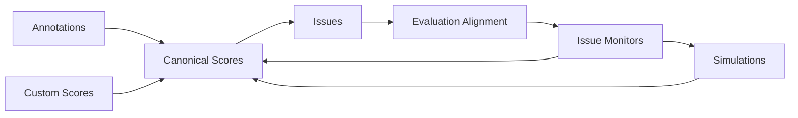

# Reliability

The reliability system is a cross-domain product/system that turns live agent traffic plus human judgment into:

- canonical scores
- discovered issues
- evaluation monitors
- long-term reliability analytics
- simulation-driven pre-ship validation

## Documentation Contract

These docs describe the intended implemented reliability system, not just a temporary snapshot of the code that has already landed.

While the reliability spec is active, some duplication between spec and docs is intentional.

The docs should remain precise enough to stand on their own after the spec is deleted.

## Core Principles

1. Canonical mutable score rows live in Postgres from day one.
2. ClickHouse stores only immutable score analytics rows used for analytics.
3. Issue search and clustering projection live in Weaviate.
4. Evaluation artifacts are stored as scripts from day one, even before the full portable runtime exists.
5. The Latitude reliability platform should be equally accessible to humans through the web app UI and to other LLM Agents through MCP/API.
6. Build reliability in `apps/web` first when that improves iteration speed, but design schemas/use-cases and public capabilities so the product does not dead-end into UI-only flows.
7. Canonical reliability domain data contracts are defined as shared Zod schemas first, with TypeScript types inferred from those schemas or the matching Drizzle schemas where appropriate.
8. Shared domain schemas validate data crossing from app/platform boundaries into domain use-cases, while external request/response contracts stay boundary-specific and may reuse or narrow those schemas.
9. Enum-like domain contracts use literal-string unions or `as const` objects, not TypeScript enums.
10. Configurable thresholds, weights, debounce windows, sentinel values, and similar tunables live in named constants inside the owning domain package rather than as scattered inline literals.
11. New reliability tables follow repository conventions: no foreign keys and RLS for organization-scoped Postgres tables.
12. Reliability background work uses the existing queue stack in `@domain/queue`, `@platform/queue-bullmq`, and `apps/workers`, with durable coordination in Postgres rather than in BullMQ job history.

## Legacy V1 References

This documentation keeps explicit legacy references to the old v1 repository.

Those references are paths relative to the repository root of branch `latitude-v1`.

Future coding agents that want to inspect the old implementation should first checkout branch `latitude-v1` in the old repository, then read the cited relative paths from that repository root.

For UI/product-surface work, old v1 components and patterns should also be treated as a reference:

- when this documentation refers to reusable v1 components, it means the old design-system components in `packages/web-ui/src/ds` from the old repository on branch `latitude-v1`
- do not reuse route-specific components from the old `apps/web/src` tree; the reliability entities, route structure, and product workflows have changed too much
- reuse as much as possible when the old design-system implementation is still solid
- do not copy v1 UI blindly; review it critically and improve it to meet v2 conventions, architecture, and quality standards when needed

## Storage Split

| Store      | Responsibility                                                                                                                                   |
| ---------- | ------------------------------------------------------------------------------------------------------------------------------------------------ |
| Postgres   | canonical `scores`, `evaluations`, `issues`, `annotation_queues`, `simulations`, and embedded settings on `organization`, `projects`, and `user` |
| ClickHouse | immutable score analytics rows, score rollups, and score-aware span/trace/session analytics                                                         |
| Weaviate   | issue title/description projection plus centroid vector for discovery/search                                                                     |

## Postgres Indexing

Postgres index design is part of the core schema work from day one, not a later optimization pass.

Rules:

- start from real query shapes: tenant scope first, then lifecycle/filter columns, then the dominant sort column
- define the needed secondary indexes in the relevant domain foundation phase together with the table definitions
- express those indexes directly in the Drizzle table model definitions, not only as surrounding prose; single-column `.unique()` constraints may stay inline on the column when that is the clearest shape
- do not add speculative JSONB, array, or text-search indexes when those queries are already served by owner-row primary keys, Weaviate, or ClickHouse

## System Loop

## Domain Layout

Reliability should not become a single `@domain/reliability` package.

Instead, the implementation should be split into direct domains such as:

- `packages/domain/scores`
- `packages/domain/annotations`
- `packages/domain/issues`
- `packages/domain/evaluations`
- `packages/domain/annotation-queues`
- `packages/domain/simulations`

Settings remain attached to their owner domains:

- organization settings stay with organizations/auth
- project settings stay with projects
- user settings stay with users/auth

Provider/model configuration and provider credentials stay embedded inside those owner `settings` JSONB payloads.

The first phase that needs each external provider capability introduces it as a platform package:

- `@platform/ai-vercel` for calling LLMs
- `@platform/ai-voyage` for embeddings and reranking
- `@platform/db-weaviate` for issue projection storage/search

Optimizer abstractions live in domain packages, while concrete optimizer implementations live in platform packages:

- `@domain/optimizations` for the optimizer interface/abstraction
- `@platform/op-gepa` for the first GEPA implementation, including the Python engine bridge and GEPA-specific runtime details

## Product Surface Implementation Pattern

Use the repository product pattern for reliability surfaces:

- human-facing reliability product pages live in `apps/web`
- server-side reads and writes for those pages live in `apps/web/src/domains/<domain>/*.functions.ts` via `createServerFn`
- reactive client state and optimistic sync live in `apps/web/src/domains/<domain>/*.collection.ts`
- route-specific reliability UI components should live in the route directory's dedicated `-components/` subfolder so route files stay separate from their supporting UI
- only rarely, when a component is genuinely shared across multiple routes, it may live in the shared `apps/web/src/components` folder
- stable public or machine-facing reliability capabilities live in `apps/api/src/routes/*` modules under the existing versioned organization-scoped path shape `/v1/organizations/{organizationId}/...`
- `apps/api` must not become the internal backend for `apps/web`; the web product should compose domain use-cases directly
- MCP clients consume that public REST API surface; reliability does not need a separate MCP-only backend contract

## Background Task Pattern

Reliability background work uses the existing async stack:

- `@domain/queue`, `@platform/queue-bullmq`, and `apps/workers` for single-step topic tasks
- the workflow abstraction plus the existing `apps/workflows` worker service for durable multi-step orchestration; Temporal is the first configured provider behind that abstraction
- the existing `domain-events` topic as the domain-event rail, with direct publication through `createEventsPublisher(queuePublisher)` for the reliability events introduced here

Rules:

- queue topics are the stable routing identity; BullMQ's per-job `name` is transport detail only
- each queue topic may define several lower-kebab-case task names, and the topic worker dispatches by that task name
- queue topic names should be added to `packages/domain/queue/src/index.ts`, while transport-facing topic constants or aliases belong in `packages/platform/queue-bullmq/src/topics.ts`
- when a topic needs payload parsing or validation for one worker only, keep that parser/validator next to the worker, for example `apps/workers/src/workers/<topic>-payload.ts`; only promote a payload contract into a domain package when several apps or phases truly share it
- domain events use PascalCase names such as `SpanIngested` and `ScoreCreated`
- queue topics use lower-kebab-case names such as `live-evaluations`
- queue payloads carry ids or opaque storage keys, not full mutable rows, and workers re-fetch current state before acting
- each queue topic owns one worker module under `apps/workers/src/workers/`
- the `domain-events` worker is a dispatcher only: it publishes downstream tasks or starts workflows and never runs synchronous business logic inline
- the domain-event routing map belongs in `apps/workers/src/workers/domain-events.ts`; later phases add new event-to-topic or event-to-workflow routes there rather than creating parallel event-consumer rails
- the new reliability domain events publish directly through `createEventsPublisher(queuePublisher)` into `domain-events` only after their upstream writes are durable
- BullMQ is transport, not lifecycle storage; durable progress, dedupe semantics, ownership, and visible progress stay in Postgres/domain state even when BullMQ provides the dedupe/debounce primitive
- topic publication may request logical dedupe/debounce keyed by entity identity so BullMQ can reuse delayed jobs or job ids without leaking transport detail to callers
- the `SpanIngested` debounced fan-out is the canonical queue-backed debounce example: each new span for a trace reschedules the same logical delayed tasks
- user-triggered async work that needs frontend progress feedback should also write a transient Redis key such as `evaluation-alignment:<jobId>`, with the UI polling an endpoint that reads Redis rather than BullMQ directly
- queues stay single-step; long-running or multi-step orchestration belongs in workflows whose activities own retries, timers, and progress
- reliability work extends the existing `apps/workflows` Temporal service and the existing `domain-events` dispatcher rail rather than introducing a second workflow runner or ad-hoc event-execution path
- workflow orchestration definitions should live in `apps/workflows/src/workflows/*.ts`, activity implementations should live in `apps/workflows/src/activities/*.ts`, and both should be re-exported from the local `index.ts` files so the worker bootstrap stays infrastructure-only
- the phase that first introduces a workflow should also introduce that workflow's concrete input schema and activity contracts; if several later phases truly need the same shared workflow contract before any one phase can own it cleanly, introduce a tiny intermediate phase then rather than speculating in the async-foundation work

Initial reliability async contracts:

- domain events: `SpanIngested`, `ScoreCreated`, `ScoreAssignedToIssue`
- topic tasks: `annotation-scores:publishHumanAnnotation`, `issues:discovery`, `issues:refresh`, `live-evaluations:enqueue`, `live-evaluations:execute`, `live-annotation-queues:curate`, `system-annotation-queues:fanOut`
- workflows: `issue-discovery`, `evaluation-alignment`, `annotation-publication`, `system-queue-flagger`

These workflow names map to concrete Temporal workflows registered in the existing `apps/workflows` service.

For the initial reliability events, `SpanIngested` publishes directly through `createEventsPublisher(queuePublisher)` because it comes from a high-volume append-only flow whose upstream write is already durable before publication.

`ScoreCreated` and `ScoreAssignedToIssue` are intentionally different from the direct-publication telemetry events: they are recorded through the transactional outbox rail so score-row persistence stays atomic with downstream fan-out. `ScoreCreated` is emitted for every canonical score write (including drafts); the `domain-events` dispatcher always publishes a deduped `issues:discovery` task plus a debounced `annotation-scores:publishHumanAnnotation` task (five-minute debounce window keyed by score id), while `issues:discovery` itself loads the score and skips when no issue work applies. The debounced annotation task only starts `annotation-publication` when the score is still a human-authored draft; otherwise it returns immediately. `ScoreAssignedToIssue` carries debounced `issues:refresh` intent after a score is linked into an existing issue.

## Spec Governance

- the local task list in `specs/reliability.md` is the source of truth for reliability planning and execution state
- the roadmap is intentionally organized as domain-vertical phases rather than horizontal system-wide layers
- each phase is intended to become one GitHub PR and one Linear issue in the `Reliability` project
- before Linear sync, phase headings should use the placeholder id `LAT-XXX`; after sync, replace them with the created Linear issue ids
- task bullets inside a phase are the local implementation checklist for that phase; they are not independently synced planning units
- synchronization is one-way from the local spec/task list to Linear
- future coding agents must update the local spec/task list first, then reconcile Linear from it
- future coding agents must not sync or reconcile Linear until the user explicitly approves the spec and explicitly instructs them to do so

## Canonical Flows

### Score ingestion

- annotation, evaluation, and custom flows all write the same canonical score model
- machine-facing score uploads use `POST /v1/organizations/:organizationId/projects/:projectId/scores`, defaulting to custom-score semantics unless `_evaluation: true` is set for a locally executed Latitude evaluation upload
- annotation ingestion remains on `POST /v1/organizations/:organizationId/projects/:projectId/annotations` even though it still writes canonical `source = "annotation"` score rows
- all score writes land in Postgres first
- ClickHouse only receives immutable score analytics rows after the score lifecycle is ready for analytics save
- every score write records `ScoreCreated` transactionally with the row; the `domain-events` dispatcher publishes a deduped `issues:discovery` task keyed by score id, and the `issues:discovery` worker runs centralized issue handling only when the loaded score is eligible (non-draft, failed, non-errored, not already linked to an issue)
- immutable-score analytics sync runs directly after the owning Postgres transaction commits through the shared `syncScoreAnalyticsUseCase`, which re-checks current Postgres immutability and dedupes by score id
- annotation-originated feedback can be enriched before issue discovery through the `annotation-publication` workflow, which runs after the debounced `annotation-scores:publishHumanAnnotation` task coalesces rapid draft edits
- draft annotations use the same annotation score model, but stay drafts through `draftedAt` instead of a fake error value
- the canonical `feedback` text must stay human/LLM-friendly and intentionally clusterable, because discovery uses it for both embeddings and BM25 matching
- scores can optionally attach to spans, traces, sessions, simulations, and issues

### Annotation queues

- annotation queues are trace-based review backlogs; session context is derived from related traces that share `session_id`
- each project starts with default system-created manual queues such as `Jailbreaking`, `Refusal`, `Frustration`, `Forgetting`, `Laziness`, `NSFW`, `Tool Call Errors`, and `Resource Outliers`
- user-managed manual queues are populated from the trace dashboard table and the sessions dashboard table; session selection resolves to the newest trace and still creates `annotation_queue_items` with `trace_id` only and `completedAt = null`
- system-created manual queues are marked with `system = true`, provision `settings.sampling` from a named default constant, and let users tune that sampling later without changing the canonical queue definitions
- system-created manual queues are populated asynchronously from debounced `SpanIngested`: the `domain-events` dispatcher publishes `system-annotation-queues:fanOut`, which lists system queues for the project, applies per-queue sampling, and starts one `system-queue-flagger` workflow per sampled queue; that workflow performs deterministic routing or a limited-context flagger pass and, when it confirms a match, writes the queue item and pending-review draft annotation with full context
- queues are conceptually live when they store the shared `FilterSet` used by evaluation triggers inside queue settings, and a dedicated `live-annotation-queues:curate` task incrementally materializes new matching traces from debounced `SpanIngested` with shared trace-filter matching before sampling and batched inserts
- newly created live annotation queues initialize `settings.sampling` from a named constant, with an initial default of `10%`
- queue review is the focused in-product annotation workflow for fast human feedback

### Issue discovery

- failed non-errored scores are embedded and searched against issue centroids/text
- drafted scores stay out of discovery until `draftedAt` is cleared
- eligible non-draft failed non-errored scores are reached when `issues:discovery` runs after `ScoreCreated`; draft rows still skip discovery because the worker re-checks eligibility against canonical Postgres state instead of running issue routing inline in request paths
- the `issues:discovery` task rechecks canonical eligibility and centralizes three branches: selected annotation issue intent (including a `ScoreCreated` payload `issueId` captured while drafting when the published row no longer stores that link), issue-linked evaluation routing for evaluation-originated failed scores that still arrive unowned, or the fallback Temporal `issue-discovery` workflow when similarity search is still needed
- annotations are primary, but unlinked failed evaluation scores and failed custom scores may also create new issues
- when discovery creates a brand-new issue, the workflow goes through a dedicated create-from-score step that generates issue details from the initial occurrence before the first issue row is persisted
- issue name/description regeneration for existing issues runs through the debounced `issues:refresh` task keyed by the canonical issue id
- new issues are named from occurrences; users can later generate evaluations from those issues when they want active monitoring
- ignoring an issue archives its linked evaluations immediately, while resolution still uses `keepMonitoring`
- the proven v1 search shape is hybrid Weaviate search with `RelativeScore` fusion, then Voyage reranking
- v2 keeps the v1 storage split of Postgres state plus Weaviate projection, but upgrades tenancy and product search behavior intentionally
- in the `issue-discovery` workflow, keep retrieval as explicit sequential activities: feedback embedding/normalization, hybrid Weaviate search, then reranking
- the shared issue-details generation use case serves both paths: synchronous first-details generation before a new issue is persisted, and later debounced refresh generation for existing issues from the last `25` assigned occurrences plus the current details as the stabilization baseline
- after rerank picks a candidate, the workflow resolves that matched issue against canonical Postgres state before deciding between the separate create-from-score and assign-to-issue activities
- the create-from-score and assign-to-issue activities re-check canonical Postgres state, conditionally claim `scores.issue_id`, persist the canonical issue row and centroid update, then the workflow runs direct `syncIssueProjectionsUseCase` and `syncScoreAnalyticsUseCase` activities after commit; only assignments into an existing issue write `ScoreAssignedToIssue` transactionally for later debounced issue-details regeneration
- the `issues:refresh` worker must re-lock and re-read the canonical issue row before saving generated details so it cannot overwrite a newer centroid or lifecycle update, and it reruns `syncIssueProjectionsUseCase` only when the persisted name/description actually changed
- existing-issue assignment must lock the canonical issue row before recomputing and saving centroid state so concurrent discovery workflows targeting the same issue serialize their centroid updates instead of losing one occurrence
- resolved and ignored issues remain valid match targets in discovery; lifecycle semantics are handled after assignment (including regression and ignored ownership behavior), not by pre-filtering them out of retrieval
- after rerank selects a best candidate, verify the selected issue row still exists in Postgres for the same organization/project before assignment; if missing, treat as no-match and create a new issue

### Evaluation alignment

- annotation-derived ground truth is split into positive and negative examples
- drafts and errored scores are excluded from evaluation alignment entirely
- evaluations generated from issues are created from the issue surfaces when the user asks for them, rather than as an automatic issue-discovery side effect
- issue-generated evaluation creation returns a `jobId` immediately and completes in the background; the frontend polls a Redis-backed status endpoint for that alignment job
- issues may have several linked evaluations; explicit generation is not limited to a single linked monitor
- live evaluation triggering is incremental on debounced `SpanIngested`; the `domain-events` dispatcher publishes `live-evaluations:enqueue`, that task checks active evaluations project-wide, applies the shared `FilterSet` first, sampling second, then turn/debounce, and publishes `live-evaluations:execute` tasks for matches; the downstream execute path persists passed, failed, and errored evaluation-originated scores through the canonical score writer
- initial issue-linked evaluation generation requires at least one failed, non-errored, non-draft human annotation linked to that issue and does not require any negative examples
- sparse first-pass monitors may be weakly aligned at first, but annotation-driven realignment should improve them as more evidence accumulates
- evaluations are script-native, GEPA-backed artifacts that run through a portable runtime shared with simulations
- newly created issue-linked evaluations initialize `trigger.sampling` from a named constant, with an initial default of `10%`
- GEPA is the first optimizer, but the optimizer interface must stay replaceable
- the optimizer objective is the scalar trajectory score derived from whether `predictedPositive` equals `expectedPositive`
- only the confusion matrix is persisted; MCC, accuracy, F1, and other metrics are derived from it
- unchanged scripts can refresh alignment incrementally before a full re-optimization run, and debounced/manual refresh work runs through the `evaluation-alignment` workflow
- v1's useful architecture split remains: TypeScript owns orchestration and candidate execution, Node workers remain the primary runtime, and Python can remain just the search engine behind a stdio JSON-RPC boundary packaged into the workers image

### Simulations

- simulations reuse the same evaluation artifact and portable runtime used by backend monitoring
- the same evaluation artifact used by the backend must run locally in the CLI
- the CLI is intentionally local-first and should remain useful as a standalone runner even without the hosted Latitude platform
- simulations include a JavaScript/TypeScript CLI and SDK, and the system can also provide additional lightweight SDKs for other languages such as Python, Ruby, PHP, and Go
- simulations can run with or without instrumentation
- results can remain local or be uploaded back to Latitude
