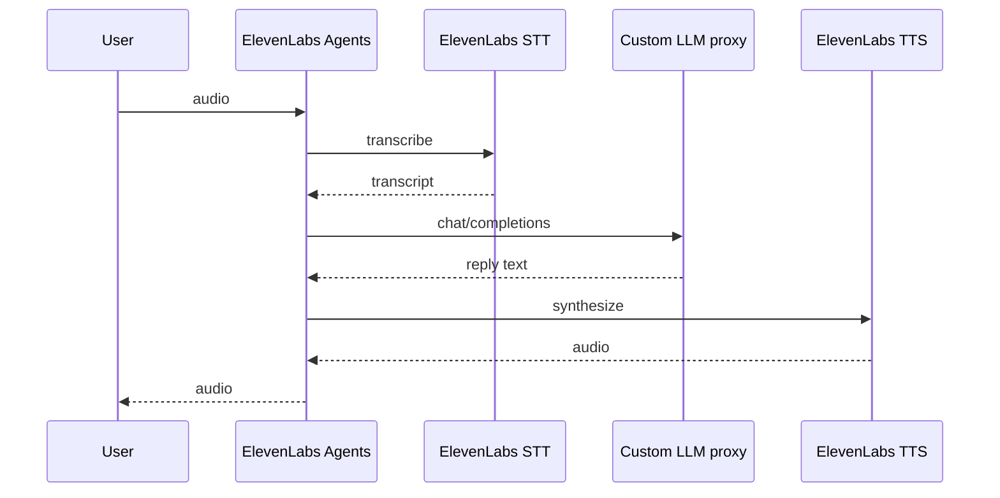

## Overview

This guide shows you how to get LLM observability for [**ElevenLabs Agents**](https://elevenlabs.io/docs/eleven-agents/overview) in Latitude.

ElevenLabs Agents is a fully hosted **voice platform**: speech-to-text, the LLM loop, and text-to-speech all run on ElevenLabs' infrastructure. ElevenLabs does not export STT or TTS traces to third parties — only the LLM step is observable, and only when you route it through infrastructure you control.

The way in is ElevenLabs' [**Custom LLM**](https://elevenlabs.io/docs/eleven-agents/customization/llm/custom-llm) feature: point your agent at an OpenAI-compatible server **you** run, and instrument that server with Latitude. Your server receives the real LLM traffic — system prompt, full conversation history, and tool definitions — so Latitude captures every turn with actual prompts, completions, token usage, and latency.

<Check>
  Your server is a thin streaming proxy in front of any OpenAI-compatible
  provider. The agent keeps running on ElevenLabs exactly as before — only the
  LLM calls route through code you can observe.
</Check>

<Note>
  Using ElevenLabs only as the **TTS/STT plugin inside LiveKit Agents**? You
  don't need this guide — instrument the LiveKit side instead. See
  [LiveKit Agents](/telemetry/frameworks/livekit).
</Note>

---

## Requirements

- A **Latitude account** and **API key**
- A **Latitude project slug**
- An **ElevenLabs agent** and an API key for an OpenAI-compatible LLM provider
- A **publicly reachable URL** for your server (use a tunnel like ngrok during development)

---

## Steps

<Steps>

  <Step title="Install">
    <Tabs>
      <Tab title="Python">
        <CodeGroup>
          ```bash pip
          pip install latitude-telemetry openai fastapi uvicorn
          ```

          ```bash uv
          uv add latitude-telemetry openai fastapi uvicorn
          ```

          ```bash poetry
          poetry add latitude-telemetry openai fastapi uvicorn
          ```
        </CodeGroup>
      </Tab>
      <Tab title="TypeScript">
        <CodeGroup>
          ```bash npm
          npm install @latitude-data/telemetry openai express
          ```

          ```bash pnpm
          pnpm add @latitude-data/telemetry openai express
          ```

          ```bash yarn
          yarn add @latitude-data/telemetry openai express
          ```
        </CodeGroup>
      </Tab>
    </Tabs>
  </Step>

  <Step title="Run an instrumented custom LLM server">
    Expose a `/v1/chat/completions` endpoint that forwards requests to your LLM provider and streams the response back as Server-Sent Events. Initializing `Latitude` with the OpenAI instrumentation is all it takes for every forwarded call to be traced.

    <Tabs>
      <Tab title="Python">
        ```python
        import os

        import openai
        from fastapi import FastAPI, Request
        from fastapi.responses import StreamingResponse
        from openai import AsyncOpenAI

        from latitude_telemetry import Latitude

        latitude = Latitude(
            api_key=os.environ["LATITUDE_API_KEY"],
            project=os.environ["LATITUDE_PROJECT_SLUG"],
            instrumentations={"openai": openai},
        )

        app = FastAPI()
        client = AsyncOpenAI()


        @app.post("/v1/chat/completions")
        async def chat_completions(request: Request):
            body = await request.json()
            body.pop("elevenlabs_extra_body", None)
            body["stream"] = True

            async def stream():
                response = await client.chat.completions.create(**body)
                async for chunk in response:
                    yield f"data: {chunk.model_dump_json()}\n\n"
                yield "data: [DONE]\n\n"

            return StreamingResponse(stream(), media_type="text/event-stream")
        ```

        Run it with `uvicorn server:app --port 8013`.
      </Tab>
      <Tab title="TypeScript">
        ```ts
        import express from "express"
        import OpenAI from "openai"
        import { createOpenAIInstrumentation } from "@latitude-data/telemetry/instrumentations/openai"
        import { Latitude } from "@latitude-data/telemetry"

        const latitude = new Latitude({
          apiKey: process.env.LATITUDE_API_KEY!,
          project: process.env.LATITUDE_PROJECT_SLUG!,
          instrumentations: [createOpenAIInstrumentation(OpenAI)],
        })

        await latitude.ready

        const app = express()
        app.use(express.json())
        const client = new OpenAI()

        app.post("/v1/chat/completions", async (req, res) => {
          const { elevenlabs_extra_body: _extra, ...body } = req.body

          res.setHeader("Content-Type", "text/event-stream")

          const stream = await client.chat.completions.create({ ...body, stream: true })
          for await (const chunk of stream) {
            res.write(`data: ${JSON.stringify(chunk)}\n\n`)
          }
          res.write("data: [DONE]\n\n")
          res.end()
        })

        app.listen(8013)
        ```
      </Tab>
    </Tabs>

    <Note>
      ElevenLabs requires streaming responses (`Content-Type: text/event-stream`),
      and your provider must support OpenAI-style **function calling** if your agent
      uses tools — ElevenLabs system tools (`end_call`, `transfer_to_agent`, etc.)
      arrive in the standard `tools` parameter.
    </Note>
  </Step>

  <Step title="Point your ElevenLabs agent at the server">
    In the [ElevenLabs dashboard](https://elevenlabs.io/app/agents), open your agent's settings:

    1. In the **LLM** dropdown, select **Custom LLM**
    2. Enter your **Server URL** (e.g. `https://your-server.example.com/v1`) and the **Model ID** your provider expects
    3. Under **API key**, create a secret with your LLM provider's key — ElevenLabs forwards it as the `Authorization` header
    4. **Publish** the agent

    Start a conversation with your agent — each turn now flows through your instrumented server.
  </Step>

</Steps>

---

## STT → LLM → TTS

ElevenLabs Agents runs the full voice loop on its own infrastructure:



### What gets traced

| Stage | Visible in Latitude | How |
| --- | --- | --- |
| **STT** | No | Runs on ElevenLabs — not exported |
| **LLM** | Yes | Via your Custom LLM proxy (steps below) |
| **TTS** | No | Runs on ElevenLabs — not exported |

Latitude only sees the **LLM step** — the `/v1/chat/completions` calls ElevenLabs forwards to your instrumented server. STT and TTS stay inside ElevenLabs and never reach your proxy.

For full **STT → LLM → TTS** tracing in Latitude, use [LiveKit Agents](/telemetry/frameworks/livekit) (native spans for all three stages) or a self-hosted [Vercel AI SDK v7](/telemetry/frameworks/vercel-ai-sdk-v7) pipeline with manual STT/TTS spans.

<Note>
  Using ElevenLabs only as the **TTS/STT plugin inside LiveKit Agents**? Instrument
  [LiveKit](/telemetry/frameworks/livekit) instead — LiveKit exports STT and TTS spans
  when the smart filter is disabled.
</Note>

---

## What you get

Because your server receives the exact requests ElevenLabs builds for the model, Latitude shows each conversation turn as a real LLM call:

- **Input messages** — the agent's system prompt and the full conversation history so far
- **Output messages** — the assistant response text and any tool calls the model emitted
- **Tool definitions** — your agent tools and ElevenLabs system tools, as sent in the request
- **Model, token usage, and latency** — from the provider's streamed response

---

## Grouping turns into conversations

Each agent turn is a separate LLM call, so by default turns appear as separate traces. To group them, enable **Custom LLM extra body** in your agent's LLM settings and pass identifiers (e.g. a conversation id) from your client as overrides — they arrive on the request as `elevenlabs_extra_body`. Use them with `capture()` to set `session_id` and `user_id` on the spans; see the [Python SDK](/telemetry/python) or [TypeScript SDK](/telemetry/typescript) guides.

<Warning>
  When using `capture()` with streaming, consume the entire stream inside the
  `capture()` callback so the full LLM call stays within the active context.
</Warning>

---

## Seeing Your Traces

Once connected, traces appear automatically in Latitude:

1. Open your **project** in the Latitude dashboard
2. Each agent turn shows the LLM call with its input/output conversation
3. Token usage and latency are aggregated at every level

<Note>
  ElevenLabs-managed LLMs (where you don't bring your own endpoint) cannot be
  traced this way — the calls never leave ElevenLabs' infrastructure. For those
  agents, conversation transcripts are available via ElevenLabs'
  [post-call webhooks](https://elevenlabs.io/docs/eleven-agents/workflows/post-call-webhooks)
  and Conversations API.
</Note>
