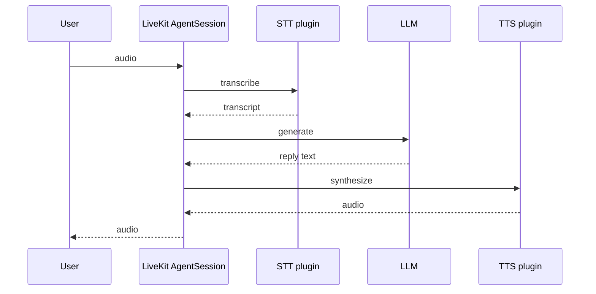

## Overview

This guide shows you how to send traces from a [**LiveKit Agents**](https://docs.livekit.io/agents/) application to Latitude.

LiveKit Agents ships with built-in OpenTelemetry support and owns its own tracer provider. Instead of bootstrapping telemetry with the `Latitude` class, you attach a **`LatitudeSpanProcessor`** to LiveKit's provider — Latitude then receives the same spans LiveKit emits for LLM, agent, and tool activity. This works the same way for the **Python** (`livekit-agents`) and **Node.js** (`@livekit/agents`) SDKs.

<Check>
  You'll keep building your LiveKit agent exactly as you do today. Latitude
  observes the LLM spans the framework already produces.
</Check>

---

## Requirements

- A **Latitude account** and **API key**
- A **Latitude project slug**
- A project that uses **LiveKit Agents** (`livekit-agents` or `@livekit/agents`)

---

## Steps

<Steps>

  <Step title="Install">
    <Tabs>
      <Tab title="Python">
        <CodeGroup>
          ```bash pip
          pip install latitude-telemetry "livekit-agents[openai]"
          ```

          ```bash uv
          uv add latitude-telemetry "livekit-agents[openai]"
          ```

          ```bash poetry
          poetry add latitude-telemetry "livekit-agents[openai]"
          ```
        </CodeGroup>
      </Tab>
      <Tab title="TypeScript">
        <CodeGroup>
          ```bash npm
          npm install @latitude-data/telemetry @opentelemetry/sdk-trace-node
          ```

          ```bash pnpm
          pnpm add @latitude-data/telemetry @opentelemetry/sdk-trace-node
          ```

          ```bash yarn
          yarn add @latitude-data/telemetry @opentelemetry/sdk-trace-node
          ```
        </CodeGroup>
      </Tab>
    </Tabs>
  </Step>

  <Step title="Register the span processor">
    Build a tracer provider, add the `LatitudeSpanProcessor`, and hand the provider to LiveKit inside your entrypoint.

    <Tabs>
      <Tab title="Python">
        ```python
        import os

        from livekit.agents import AgentSession, JobContext
        from livekit.agents.telemetry import set_tracer_provider
        from opentelemetry.sdk.trace import TracerProvider

        from latitude_telemetry import LatitudeSpanProcessor


        def setup_latitude_telemetry():
            provider = TracerProvider()
            provider.add_span_processor(
                LatitudeSpanProcessor(
                    os.environ["LATITUDE_API_KEY"],
                    os.environ["LATITUDE_PROJECT_SLUG"],
                )
            )
            set_tracer_provider(provider)


        async def entrypoint(ctx: JobContext):
            setup_latitude_telemetry()

            session = AgentSession(
                # ... your STT / LLM / TTS configuration
            )
            # ... start your agent as usual
        ```
      </Tab>
      <Tab title="TypeScript">
        ```ts
        import { telemetry, type JobContext } from "@livekit/agents"
        import { LatitudeSpanProcessor } from "@latitude-data/telemetry"
        import { NodeTracerProvider } from "@opentelemetry/sdk-trace-node"

        function setupLatitudeTelemetry() {
          const provider = new NodeTracerProvider({
            spanProcessors: [
              new LatitudeSpanProcessor(
                process.env.LATITUDE_API_KEY!,
                process.env.LATITUDE_PROJECT_SLUG!,
              ),
            ],
          })
          telemetry.setTracerProvider(provider)
        }

        export default async function entrypoint(ctx: JobContext) {
          setupLatitudeTelemetry()

          // ... build and start your AgentSession as usual
        }
        ```
      </Tab>
    </Tabs>
  </Step>

</Steps>

---

## STT → LLM → TTS

LiveKit Agents runs the full voice pipeline — speech-to-text, an LLM turn, and text-to-speech — inside `AgentSession`. LiveKit emits OpenTelemetry spans for each stage; Latitude receives them through `LatitudeSpanProcessor`.



### What gets traced

| Stage | Traced by default | Content in Latitude |
| --- | --- | --- |
| **STT** | No (smart filter) | Enable with `disableSmartFilter` |
| **LLM** | Yes | Prompts, completions, tools, tokens via `gen_ai.*` and `lk.*` |
| **TTS** | No (smart filter) | Enable with `disableSmartFilter` |

By default, Latitude's smart filter forwards **LLM spans only**. To include STT, TTS, and VAD spans in every trace, disable the filter when creating the processor:

<CodeGroup>
  ```python Python
  from latitude_telemetry import LatitudeSpanProcessor, LatitudeSpanProcessorOptions

  LatitudeSpanProcessor(
      api_key,
      project,
      LatitudeSpanProcessorOptions(disable_smart_filter=True),
  )
  ```

  ```ts TypeScript
  new LatitudeSpanProcessor(apiKey, project, { disableSmartFilter: true })
  ```
</CodeGroup>

LiveKit serializes conversation content in `lk.*` attributes. Latitude parses those alongside `gen_ai.*` metadata — STT transcripts in `audio_content` items are normalized to text parts.

<Note>
  Using ElevenLabs as the TTS/STT plugin inside LiveKit? Instrument LiveKit on
  this page — not the [ElevenLabs Agents](/telemetry/frameworks/elevenlabs) guide.
</Note>

---

## What you get

### LLM turns (default)

LiveKit's LLM spans carry both `gen_ai.*` metadata and the conversation content in custom `lk.*` attributes. Latitude parses both, so each LLM turn shows up with:

- **Model and provider** — from `gen_ai.request.model` / `gen_ai.provider.name`
- **Token usage and latency** — input/output tokens, time-to-first-token
- **Input messages** — the chat context (system prompt, user turns, prior tool calls and results)
- **Output messages** — the assistant response text and any tool calls the model emitted
- **Tool definitions** — the function tools available to the agent

Audio in the chat context (e.g. STT transcripts in `audio_content` items) is normalized to text parts in Latitude.

---

## Seeing Your Traces

Once connected, traces appear automatically in Latitude:

1. Open your **project** in the Latitude dashboard
2. Each agent turn shows the LLM call with its input/output conversation
3. Token usage and latency are aggregated at every level
