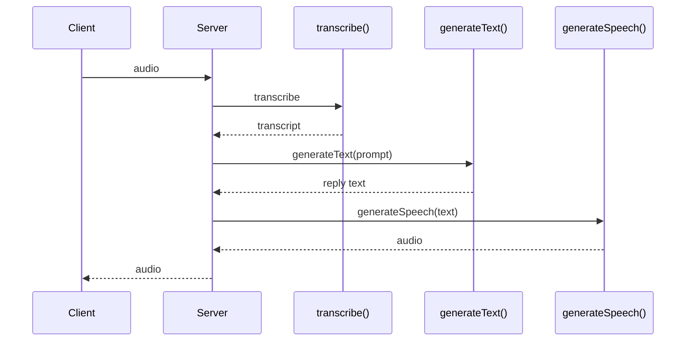

## Overview

This guide shows you how to integrate **Latitude Telemetry** into an application that uses **Vercel AI SDK v7**.

<Note>
  Using **Vercel AI SDK v6**? See the [Vercel AI SDK](/telemetry/frameworks/vercel-ai-sdk) guide
  instead — its telemetry setup is different.
</Note>

In v7, OpenTelemetry collection **moved out of the `ai` package** into the separate **`@ai-sdk/otel`** package, and it is now **opt-out**: once you register a telemetry integration, every AI SDK call emits telemetry by default — there is no per-call `experimental_telemetry` flag anymore. Latitude ingests those spans without a provider-specific instrumentation entry.

<Check>
  You'll keep calling the Vercel AI SDK exactly as you do today. Telemetry simply
  observes and enriches those calls.
</Check>

<Note>
  The Vercel AI SDK integration is **TypeScript only**.
</Note>

---

## Requirements

- A **Latitude account** and **API key**
- A **Latitude project slug**
- A Node.js project that uses **Vercel AI SDK v7** (`ai@7`) and the matching **`@ai-sdk/otel`**

---

## Steps

<Steps>

  <Step title="Install">
    Install Latitude Telemetry and the AI SDK v7 OpenTelemetry package.

    <CodeGroup>
      ```bash npm
      npm install @latitude-data/telemetry @ai-sdk/otel
      ```

      ```bash pnpm
      pnpm add @latitude-data/telemetry @ai-sdk/otel
      ```

      ```bash yarn
      yarn add @latitude-data/telemetry @ai-sdk/otel
      ```

      ```bash bun
      bun add @latitude-data/telemetry @ai-sdk/otel
      ```
    </CodeGroup>
  </Step>

  <Step title="Initialize and use">
    Initialize Latitude **without** an `instrumentations` array. Then register the AI SDK
    `OpenTelemetry` integration **once**, after constructing `Latitude` — it uses the global tracer
    provider that Latitude registered, so spans flow to Latitude automatically. No per-call flag is
    needed.

    ```ts
    import { Latitude, capture } from "@latitude-data/telemetry"
    import { generateText, registerTelemetry } from "ai"
    import { OpenTelemetry } from "@ai-sdk/otel"
    import { openai } from "@ai-sdk/openai"

    const latitude = new Latitude({
      apiKey: process.env.LATITUDE_API_KEY!,
      project: process.env.LATITUDE_PROJECT_SLUG!,
    })

    // Register once, after Latitude. All AI SDK calls now emit telemetry (opt-out).
    registerTelemetry(new OpenTelemetry())

    await capture("generate-support-reply", async () => {
      const { text } = await generateText({
        model: openai("gpt-4o"),
        prompt: "Hello",
      })
      return text
    })

    await latitude.shutdown()
    ```

    <Note>
      The recommended integration is `OpenTelemetry`, which emits standard OpenTelemetry GenAI
      semantic-convention spans. `@ai-sdk/otel` also exports `LegacyOpenTelemetry`, which emits the
      older `ai.*` spans (same as v6). Latitude ingests both.
    </Note>
  </Step>

</Steps>

<Warning>
  **Pass your system prompt via the `instructions` field.** AI SDK v7's telemetry drops
  `role: "system"` messages placed inside `messages`, so they won't appear in your traces. Use the
  top-level `instructions` field instead — it's captured correctly.

  ```ts
  await generateText({
    model: openai("gpt-4o"),
    instructions: "You are a helpful assistant.", // ✅ shows up in traces
    prompt: "Hello",
  })
  ```
</Warning>

### Next.js

Register the integration in your `instrumentation.ts`, alongside your OpenTelemetry provider setup:

```ts instrumentation.ts
import { registerOTel } from "@vercel/otel"
import { registerTelemetry } from "ai"
import { OpenTelemetry } from "@ai-sdk/otel"

export function register() {
  registerOTel({ serviceName: "my-ai-app" })
  registerTelemetry(new OpenTelemetry())
}
```

### Opting out

Telemetry is opt-out. To disable it for a specific call, set `telemetry: { isEnabled: false }`. To disable it globally, don't register any telemetry integration.

---

## STT → LLM → TTS

AI SDK 7 ships stable [`transcribe()`](https://sdk.vercel.ai/docs/reference/ai-sdk-core/transcribe) and [`generateSpeech()`](https://sdk.vercel.ai/docs/reference/ai-sdk-core/generate-speech) on [AI Gateway](https://vercel.com/docs/ai-gateway). A typical voice turn chains all three:

1. **STT** — `transcribe()` converts incoming audio to text
2. **LLM** — `generateText()` (or `streamText()`) produces a reply
3. **TTS** — `generateSpeech()` synthesizes the reply as audio

`@ai-sdk/otel` traces the **LLM step automatically**. It does not yet emit spans for `transcribe()` or `generateSpeech()` — wrap those calls in manual OpenTelemetry spans inside a `capture()` boundary so all three stages appear in one trace.



### One voice turn

```ts
import { readFile } from "node:fs/promises"
import { trace } from "@opentelemetry/api"
import { openai } from "@ai-sdk/openai"
import { generateSpeech, generateText, transcribe } from "ai"
import { capture } from "@latitude-data/telemetry"

const tracer = trace.getTracer("voice.pipeline")

async function handleVoiceTurn(audioPath: string, sessionId: string) {
  return capture(
    "voice-turn",
    async () => {
      const audio = await readFile(audioPath)

      const { text: transcript } = await tracer.startActiveSpan(
        "transcribe whisper-1",
        async (span) => {
          span.setAttribute("gen_ai.operation.name", "transcribe")
          span.setAttribute("gen_ai.provider.name", "openai")
          span.setAttribute("gen_ai.request.model", "whisper-1")

          const result = await transcribe({
            model: openai.transcription("whisper-1"),
            audio,
          })

          span.setAttribute(
            "gen_ai.output.messages",
            JSON.stringify([
              {
                role: "assistant",
                parts: [{ type: "text", content: result.text }],
              },
            ]),
          )
          span.end()
          return result
        },
      )

      const { text: reply } = await generateText({
        model: openai("gpt-4o"),
        instructions: "You are a concise voice assistant.",
        prompt: transcript,
      })

      await tracer.startActiveSpan("speech tts-1", async (span) => {
        span.setAttribute("gen_ai.operation.name", "speech")
        span.setAttribute("gen_ai.provider.name", "openai")
        span.setAttribute("gen_ai.request.model", "tts-1")
        span.setAttribute(
          "gen_ai.input.messages",
          JSON.stringify([
            { role: "user", parts: [{ type: "text", content: reply }] },
          ]),
        )

        const { audio: speechAudio } = await generateSpeech({
          model: openai.speech("tts-1"),
          text: reply,
          voice: "alloy",
        })

        span.setAttribute("voice.output.bytes", speechAudio.uint8Array.byteLength)
        span.end()
        return speechAudio
      })
    },
    { sessionId, tags: ["voice", "stt-llm-tts"] },
  )
}
```

Pass a stable `sessionId` on every `capture()` call to group voice turns into a conversation in Latitude.

### What you see in Latitude

| Stage | Traced by | Span operation |
| --- | --- | --- |
| STT | Manual span | `transcribe` — transcript in output messages |
| LLM | `@ai-sdk/otel` | `chat` — full input/output, tokens, latency |
| TTS | Manual span | `speech` — input text, model, audio byte count |

Models on AI Gateway (e.g. `openai/whisper-1`, `openai/tts-1`) resolve for cost tracking the same way as chat models.

<Note>
  `experimental_useRealtime` (browser WebSocket voice) does not produce
  server-side `@ai-sdk/otel` spans. For realtime voice observability, use
  [LiveKit Agents](/telemetry/frameworks/livekit) or wrap backend tool routes in
  `capture()`.
</Note>

---

## Seeing Your Traces

Once connected, traces appear automatically in Latitude:

1. Open your **project** in the Latitude dashboard
2. Each execution shows input/output messages, model, token usage, latency, and errors
