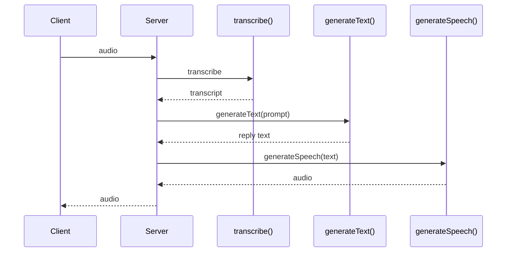

## Overview

Voice agents chain three model calls: **speech-to-text (STT)**, an **LLM** turn, and **text-to-speech (TTS)**. Latitude traces the LLM step automatically when your framework emits OpenTelemetry spans. STT and TTS are visible when the framework exports them, or when you add short manual spans around those calls.

This guide covers the **STT → LLM → TTS** pattern and how it maps to the voice integrations Latitude supports today.

<CardGroup cols={3}>
  <Card title="Vercel AI SDK v7" icon="code" href="/telemetry/frameworks/vercel-ai-sdk-v7">
    Self-hosted pipeline with `transcribe`, `generateText`, and `generateSpeech` on AI Gateway.
  </Card>
  <Card title="LiveKit Agents" icon="microphone" href="/telemetry/frameworks/livekit">
  Full voice stack with built-in STT, LLM, and TTS spans.
  </Card>
  <Card title="ElevenLabs Agents" icon="volume-2" href="/telemetry/frameworks/elevenlabs">
    Hosted voice platform — observe the LLM via a Custom LLM proxy.
  </Card>
</CardGroup>

---

## What gets traced

| Stage | Vercel AI SDK v7 | LiveKit Agents | ElevenLabs Agents |
| --- | --- | --- | --- |
| **STT** | Manual span around `transcribe()` | Automatic (disable smart filter) | Hosted — not exported |
| **LLM** | Automatic via `@ai-sdk/otel` | Automatic | Via Custom LLM proxy |
| **TTS** | Manual span around `generateSpeech()` | Automatic (disable smart filter) | Hosted — not exported |
| **Realtime WebSocket** (`useRealtime`) | Not traced server-side today | N/A | N/A |

<Note>
  `@ai-sdk/otel` instruments text/agent calls (`generateText`, `streamText`, tools,
  embeddings, rerank). It does **not** yet emit spans for `transcribe()` or
  `generateSpeech()`. Wrap those calls in manual spans (see below) or use LiveKit
  for turnkey STT/TTS visibility.
</Note>

---

## STT → LLM → TTS with Vercel AI SDK v7

A common server-side voice loop: transcribe incoming audio, run the LLM, synthesize the reply.



### Setup

Follow the [Vercel AI SDK v7](/telemetry/frameworks/vercel-ai-sdk-v7) guide first — install `@latitude-data/telemetry` and `@ai-sdk/otel`, then register telemetry once at startup.

### One voice turn inside `capture()`

Wrap the full turn in `capture()` so STT, LLM, and TTS spans share the same session and tags. The LLM step is traced automatically; add manual spans for STT and TTS using GenAI semantic-convention attributes.

```ts
import { readFile } from "node:fs/promises"
import { trace } from "@opentelemetry/api"
import { openai } from "@ai-sdk/openai"
import { OpenTelemetry } from "@ai-sdk/otel"
import { generateSpeech, generateText, registerTelemetry, transcribe } from "ai"
import { capture, Latitude } from "@latitude-data/telemetry"

const latitude = new Latitude({
  apiKey: process.env.LATITUDE_API_KEY!,
  project: process.env.LATITUDE_PROJECT_SLUG!,
})

registerTelemetry(new OpenTelemetry())

const tracer = trace.getTracer("voice.pipeline")

async function handleVoiceTurn(audioPath: string, sessionId: string) {
  return capture(
    "voice-turn",
    async () => {
      const audio = await readFile(audioPath)

      const { text: transcript } = await tracer.startActiveSpan(
        "transcribe whisper-1",
        async (span) => {
          span.setAttribute("gen_ai.operation.name", "transcribe")
          span.setAttribute("gen_ai.provider.name", "openai")
          span.setAttribute("gen_ai.request.model", "whisper-1")

          const result = await transcribe({
            model: openai.transcription("whisper-1"),
            audio,
          })

          span.setAttribute(
            "gen_ai.output.messages",
            JSON.stringify([
              {
                role: "assistant",
                parts: [{ type: "text", content: result.text }],
              },
            ]),
          )
          span.end()
          return result
        },
      )

      const { text: reply } = await generateText({
        model: openai("gpt-4o"),
        instructions: "You are a concise voice assistant.",
        prompt: transcript,
      })

      await tracer.startActiveSpan("speech tts-1", async (span) => {
        span.setAttribute("gen_ai.operation.name", "speech")
        span.setAttribute("gen_ai.provider.name", "openai")
        span.setAttribute("gen_ai.request.model", "tts-1")
        span.setAttribute(
          "gen_ai.input.messages",
          JSON.stringify([
            { role: "user", parts: [{ type: "text", content: reply }] },
          ]),
        )

        const { audio: speechAudio } = await generateSpeech({
          model: openai.speech("tts-1"),
          text: reply,
          voice: "alloy",
        })

        span.setAttribute("voice.output.bytes", speechAudio.uint8Array.byteLength)
        span.end()
        return speechAudio
      })
    },
    { sessionId, tags: ["voice", "stt-llm-tts"] },
  )
}
```

<Warning>
  Pass system prompts via the top-level `instructions` field on `generateText` —
  not `role: "system"` inside `messages`. AI SDK v7 telemetry drops inline system
  messages.
</Warning>

### What you see in Latitude

- **Transcribe span** — operation `transcribe`, model, transcript in output messages
- **Chat span** — full LLM input/output, token usage, latency (from `@ai-sdk/otel`)
- **Speech span** — operation `speech`, input text, model; audio bytes as a custom attribute
- **Capture root** — groups all three under one trace with shared `sessionId`

Models routed through [Vercel AI Gateway](https://vercel.com/docs/ai-gateway) (e.g. `openai/whisper-1`, `openai/tts-1`) resolve for cost tracking the same way as chat models.

### Realtime voice (`useRealtime`)

`experimental_useRealtime` runs a browser WebSocket session directly to the provider. That path does not emit server-side `@ai-sdk/otel` spans today. For production realtime voice observability, use [LiveKit Agents](/telemetry/frameworks/livekit) or instrument your backend tool routes with `capture()`.

---

## LiveKit Agents

[LiveKit Agents](/telemetry/frameworks/livekit) is the turnkey option when you want STT, LLM, and TTS in one framework. LiveKit emits OpenTelemetry spans for each stage; Latitude attaches via `LatitudeSpanProcessor`.

By default, Latitude's smart filter forwards **LLM spans only**. To include STT, TTS, and VAD spans in your traces, disable the filter:

<CodeGroup>
  ```python Python
  from latitude_telemetry import LatitudeSpanProcessor, LatitudeSpanProcessorOptions

  LatitudeSpanProcessor(
      api_key,
      project,
      LatitudeSpanProcessorOptions(disable_smart_filter=True),
  )
  ```

  ```ts TypeScript
  new LatitudeSpanProcessor(apiKey, project, { disableSmartFilter: true })
  ```
</CodeGroup>

LiveKit serializes conversation content in `lk.*` attributes; Latitude parses those alongside `gen_ai.*` metadata so each LLM turn shows prompts, completions, tools, and token usage.

<Note>
  Using ElevenLabs as the TTS/STT plugin inside LiveKit? Instrument LiveKit — not
  the [ElevenLabs Agents](/telemetry/frameworks/elevenlabs) guide.
</Note>

---

## ElevenLabs Agents

[ElevenLabs Agents](/telemetry/frameworks/elevenlabs) runs STT, the LLM loop, and TTS on ElevenLabs' infrastructure. Those hosted calls are not exported to third-party observability tools.

To observe the **LLM step**, use ElevenLabs' **Custom LLM** feature: point your agent at an OpenAI-compatible server you control, instrument that server with Latitude, and ElevenLabs forwards the real model traffic (system prompt, conversation history, tools) through your proxy. STT and TTS remain inside ElevenLabs and will not appear in Latitude traces.

For full STT → LLM → TTS visibility, prefer **LiveKit** or a **self-hosted Vercel AI SDK** pipeline instead.

---

## Grouping turns into sessions

Voice agents produce multiple traces per conversation. Pass a stable `sessionId` (and optional `userId`) on every `capture()` call so Latitude groups turns into a session:

```ts
await capture("voice-turn", runTurn, {
  sessionId: conversationId,
  userId: callerId,
  tags: ["voice", "production"],
})
```

For ElevenLabs Custom LLM setups, pass conversation identifiers through `elevenlabs_extra_body` and read them in your proxy — see the [ElevenLabs guide](/telemetry/frameworks/elevenlabs#grouping-turns-into-conversations).

---

## Choosing an integration

| Goal | Recommended path |
| --- | --- |
| Self-hosted STT/LLM/TTS on AI SDK 7 + AI Gateway | [Vercel AI SDK v7](/telemetry/frameworks/vercel-ai-sdk-v7) + manual STT/TTS spans (this guide) |
| Production voice agents with minimal custom tracing | [LiveKit Agents](/telemetry/frameworks/livekit) |
| ElevenLabs-hosted agent, LLM observability only | [ElevenLabs Custom LLM](/telemetry/frameworks/elevenlabs) |
| Browser realtime WebSocket (`useRealtime`) | Not auto-traced — use LiveKit or manual backend instrumentation |

---

## Seeing your traces

Once connected, traces appear in your Latitude project:

1. Open **Traces** in the dashboard
2. Each voice turn shows the capture root and child spans (STT, chat, TTS)
3. Filter by `sessionId` or tags like `voice` to review full conversations
