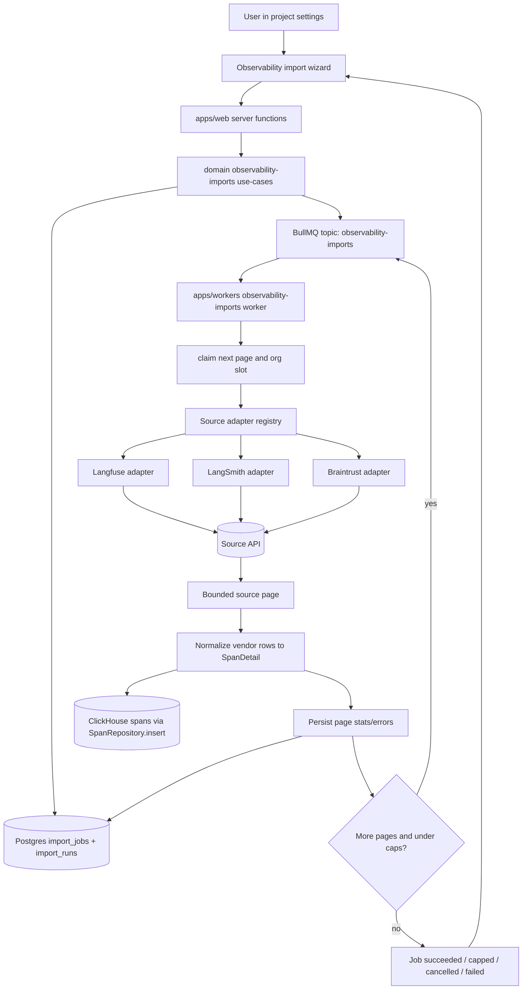

# Observability platform migration tool

> **Spec only - no production implementation.** Concrete implementation plan for a self-serve project settings wizard that imports historical traces/spans from Langfuse, LangSmith, or Braintrust into Latitude.
>
> **Origin:** LAT-721. Customer feedback from the Braintrust workshop: evaluators need a credible way to bring historical observability data into Latitude, not only forward OTLP ingestion.
>
> **Related:** `dev-docs/data-destinations.md`, `packages/domain/spans/src/use-cases/process-ingested-spans.ts`, `packages/domain/spans/src/ports/span-repository.ts`, `apps/workers/src/workers/span-ingestion.ts`, `packages/domain/queue/src/topic-registry.ts`, `apps/web/src/routes/_authenticated/projects/$projectSlug/settings/`.

## Contents

1. [A. Critique of current spec](#a-critique-of-current-spec)
2. [B. Revised architecture (keep it simple)](#b-revised-architecture-keep-it-simple)
3. [C. Limits and defaults (concrete numbers)](#c-limits-and-defaults-concrete-numbers)
4. [D. UI flow (step-by-step for users)](#d-ui-flow-step-by-step-for-users)
5. [E. Implementation phases (step-by-step for engineers)](#e-implementation-phases-step-by-step-for-engineers)
6. [F. Source adapter interface](#f-source-adapter-interface)
7. [G. What to remove/simplify from current spec](#g-what-to-removesimplify-from-current-spec)
8. [H. Full markdown patch](#h-full-markdown-patch)
9. [Appendix: source mapping notes](#appendix-source-mapping-notes)

---

## A. Critique of current spec

The previous spec has useful source-platform research and mapping notes, but it does not yet describe the product Latitude should build first.

### Misaligned with UI-first requirement

- It makes the MVP **CLI-first** (`latitude migrate import ...`) and **staff/backoffice assisted**, with the self-serve UI deferred to Phase 4.
- It treats credentials as local CLI inputs or staff-operated secrets instead of defining a project-settings flow with encrypted credentials, dry-run preview, confirmation, progress, cancellation, and completion.
- It does not reference the current project settings structure:
  - settings nav lives in `apps/web/src/domains/projects/project-sections.ts`;
  - settings pages use `SettingsPage` under `apps/web/src/routes/_authenticated/projects/$projectSlug/settings/-components/`;
  - project settings server functions live under `apps/web/src/domains/*/*.functions.ts`.

### Too many ingestion paths

- It recommends a hybrid of API pull, vendor blob export, self-host DB access, CLI, and backoffice. That is too much for a self-serve MVP.
- It implies three source-specific migration tracks. The simpler shape is **one import engine** with source adapters for Langfuse, LangSmith, and Braintrust.
- It discusses OTLP HTTP as an optional write path. Historical imports should not round-trip through public OTLP HTTP; they should normalize to Latitude span rows and write through the same ClickHouse repository boundary used after ingestion transforms.

### Limits are not concrete enough

- It warns that large backfills are dangerous, but does not define user-visible defaults or hard caps.
- It does not define:
  - default lookback window;
  - hard self-serve lookback cap;
  - max spans per import;
  - max active imports per org;
  - worker concurrency;
  - source API rate limits;
  - dry-run preview cap;
  - cancellation and credential retention behavior.
- It risks a user selecting "all history" against years of data and tying up workers or source APIs for days.

### Scale and tenancy are under-specified

- It says imports must be idempotent/resumable, but does not define the queue granularity. A single BullMQ job must not run for hours. The engine should process one bounded page/window per job, persist cursor/stats, then re-enqueue the next page.
- It does not define an org-level concurrency guard. Multi-tenant imports need a hard **one active import per organization** default.
- It does not specify how progress is stored for the UI. Users need stable PG-backed state, not worker logs.
- It does not distinguish imported historical telemetry from live ingest for billing and live-evaluation fan-out.

### Scope is too broad for a minimal MVP

- Scores, datasets, prompt registries, media attachments, source DB access, Parquet/blob paths, and continuous sync are valuable later but distract from the user requirement: self-serve historical span import.
- The previous phase order ships Langfuse first and LangSmith/Braintrust later. The user requirement is to support **all three source platforms** behind one UX and one engine.

---

## B. Revised architecture (keep it simple)

### Recommendation

Build one self-serve **Observability imports** feature in project settings.

The MVP imports **traces/spans/sessions identity, user identity, tags, metadata, messages, usage, and cost** from Langfuse, LangSmith, and Braintrust. It does not import scores, datasets, prompts, media, or continuous sync.

The implementation is one queue-driven import engine:

- UI creates a project-scoped import job after dry-run preview.
- The job stores encrypted source credentials, non-secret config, cursor, stats, limits, status, and sanitized errors in Postgres.
- A BullMQ topic processes one source page/window at a time.
- Source adapters fetch vendor rows and normalize them to Latitude `SpanDetail` rows.
- The engine writes normalized spans through `SpanRepository.insert` (`packages/domain/spans/src/ports/span-repository.ts`), not through OTLP HTTP.
- The engine persists progress after every page and re-enqueues itself until the range/cap is exhausted, cancelled, or failed.
- Imported spans are tagged with provenance metadata and are **not billable by default**.

### Architecture diagram



### Why this is the simplest architecture

It reuses existing Latitude rails instead of adding a migration subsystem:

- **Project settings UI:** follow the data-destinations settings shape under `apps/web/src/routes/_authenticated/projects/$projectSlug/settings/`.
- **Server functions:** follow `apps/web/src/domains/destinations/destinations.functions.ts` for org-scoped `createServerFn`, Zod validation, RLS-backed Postgres access, and queue publication.
- **Queue registry:** add one topic to `packages/domain/queue/src/topic-registry.ts`, then subscribe in `apps/workers/src/workers/observability-imports.ts`.
- **Worker shape:** mirror `apps/workers/src/workers/span-ingestion.ts` for Effect layers, tracing, ClickHouse/Postgres clients, and bounded concurrency.
- **Bounded historical processing:** mirror the data-destinations backfill idea from `dev-docs/data-destinations.md`: one low-priority lane, one page/window at a time, cursor advances only after the page writes.
- **ClickHouse writes:** reuse `SpanRepository.insert` and the existing `spans` table. Do not write `traces` or `sessions`; materialized views rebuild from spans.

### Data model

Create a small `@domain/observability-imports` package and Postgres tables in `@platform/db-postgres`.

#### `observability_import_jobs`

One row per user-confirmed import.

| Column | Purpose |
| --- | --- |
| `id` | CUID primary key |
| `organization_id` | RLS and org concurrency |
| `project_id` | Target Latitude project |
| `source` | `langfuse | langsmith | braintrust` |
| `source_project_id` | Vendor project/workspace identifier selected by user |
| `source_project_name` | Snapshot for UI |
| `status` | `queued | running | succeeded | capped | cancelled | failed` |
| `config` | Non-secret config: time range, max spans, session metadata key, include content |
| `credentials` | Encrypted source credentials while runnable; nullable after terminal scrub; never returned to the client |
| `cursor` | Adapter cursor JSON, updated after each successful page |
| `stats` | Counts: fetched, imported, skipped, failed, estimated total |
| `limits` | Effective caps snapshotted at confirmation |
| `last_error` | Sanitized error string/category |
| `cancel_requested_at` | UI cancellation marker checked between pages |
| `started_at`, `finished_at` | UI progress and audit |
| timestamps | `created_at`, `updated_at` |

Indexes:

- `(organization_id, status)` for active-org guard.
- `(organization_id, project_id, created_at desc)` for settings UI.
- Partial unique index for one queued/running import per org: `organization_id where status in ('queued', 'running')`.

No foreign keys, matching repository conventions. A `ProjectDeleted` domain-event consumer should cancel/delete project imports in a later hardening PR.

#### `observability_import_runs`

One audit row per processed page/window. Retain 30 days.

| Column | Purpose |
| --- | --- |
| `id` | CUID primary key |
| `organization_id` | RLS |
| `job_id` | Import job id |
| `status` | `succeeded | failed | skipped` |
| `cursor_start`, `cursor_end` | JSON cursor snapshots |
| `window_start`, `window_end` | Source time window for this page |
| `records_fetched` | Source records read |
| `spans_imported` | Normalized spans inserted |
| `spans_skipped` | Dropped by mapping/validation/idempotency |
| `error` | Sanitized error |
| `started_at`, `finished_at` | Page timing |

This mirrors `destination_sync_runs` enough to power "latest page, counts, errors" UI without adding a complex run-history product.

### Queue topic

Add one topic in `packages/domain/queue/src/topic-registry.ts`:

```ts
"observability-imports": payloads<{
  start: {
    readonly organizationId: string
    readonly projectId: string
    readonly importJobId: string
  }
  fetchPage: {
    readonly organizationId: string
    readonly projectId: string
    readonly importJobId: string
  }
  pruneRuns: Record<string, never>
}>()
```

Worker:

- `apps/workers/src/workers/observability-imports.ts`
- Subscribe with platform concurrency `8`.
- Every `fetchPage` job:
  1. Reloads the import job from Postgres.
  2. Skips if cancelled, terminal, project/org mismatch, or over cap.
  3. Acquires/validates the org-level active slot.
  4. Calls adapter `fetchPage` with the persisted cursor, time range, and page limit.
  5. Normalizes rows to `SpanDetail`.
  6. Inserts spans through `SpanRepository.insert`.
  7. Writes one `observability_import_runs` row and advances job stats/cursor.
  8. Re-enqueues `fetchPage` when the adapter reports more data and caps are not reached.
  9. Marks terminal state when done/capped/cancelled/failed.

No Temporal workflow is needed. A self-advancing BullMQ page chain is enough and matches data-destinations backfill.

### Imported span policy

Normalized spans must include provenance:

```ts
metadata: {
  "import.job_id": importJobId,
  "import.source": source,
  "import.source_project_id": sourceProjectId,
  "import.source_trace_id": sourceTraceId,
  "import.source_span_id": sourceSpanId,
}
```

Id mapping:

- `trace_id`: deterministic 32-character lowercase hex from source trace/root id.
- `span_id`: deterministic 16-character lowercase hex from source span/run/observation id.
- `parent_span_id`: deterministic mapping of source parent id, empty for root.
- Same source ids always map to the same Latitude ids, so re-runs are idempotent through ClickHouse `ReplacingMergeTree(ingested_at)` behavior.

Billing/live automation:

- Historical imports should not pass billing context into any ingest event.
- MVP should not fan out live evaluation/flagger scans for every imported trace. If search indexing needs a refresh, add a capped import-specific refresh task later rather than publishing `TracesIngested` blindly for millions of historical traces.

---

## C. Limits and defaults (concrete numbers)

All limits are enforced server-side in domain use-cases and snapshotted onto the import job at confirmation. UI controls may expose narrower values, but the backend owns the cap.

| Limit | Default | Hard cap | Scope | Rationale |
| --- | ---: | ---: | --- | --- |
| Default lookback | 90 days | 365 days | Per import | Recent history is what evaluators need first; avoids accidental multi-year imports. |
| Minimum lookback | 1 day | N/A | Per import | Keeps previews and source filters sane. |
| Max spans per import | 250,000 | 1,000,000 | Per import job | Matches data-destinations' 1M backfill ceiling as an operational guard. |
| Max queued/running imports | 1 | 1 | Per org | Fairness and predictable source/API pressure. |
| Max concurrent import pages | 8 | 8 | Platform workers | Low-priority lane that cannot starve ingestion or other workers. |
| Worker job unit | 1 page/window | 1 page/window | BullMQ task | Each job should finish quickly and re-enqueue; no hour-long jobs. |
| Source page size | 1,000 source records | 5,000 | API adapters | Good default for source APIs; adapters may lower it by platform. |
| ClickHouse insert chunk | 5,000 spans | 10,000 | Per worker page | Keeps memory/parts bounded while preserving insert efficiency. |
| Dry-run source scan | 5 pages or 5,000 records | 10 pages or 10,000 records | Per preview | Gives a useful estimate/sample without starting a migration. |
| Dry-run timeout | 30 seconds | 60 seconds | Per preview request | UI request must remain interactive. |
| Import page timeout | 120 seconds | 120 seconds | Per BullMQ job | Failed page retries without holding a worker forever. |
| BullMQ attempts | 5 | 5 | Per page job | Existing retry convention; terminal failure is visible in PG. |
| Retry backoff | Exponential, 10s start, 10m max | Same | Per page job | Handles transient 429/5xx without hot looping. |
| Langfuse rate limit | 60 req/min | Configurable lower of plan/request headers | Per org+source | Safe under common cloud buckets; respect `Retry-After`. |
| LangSmith rate limit | 12 req/min | Configurable lower of response headers | Per org+source | Safe for large-window limits (3 req / 10 sec). |
| Braintrust rate limit | 60 req/min | Configurable lower of response headers | Per org+source | Conservative default; BTQL performance varies by query. |
| Source project listing | 100 projects/page | 500 total in UI | Preview/list call | Keeps wizard fast; search can be added later. |
| Run audit retention | 30 days | 30 days | `observability_import_runs` | Matches destination sync-run retention. |
| Credential retention | Until terminal + 7 days | 7 days after terminal | Import job | Allows retry/debug window while limiting secret exposure. |
| Cancel latency | Current page finishes first | 120 seconds target | Per job | Cancellation is cooperative between pages. |

Default UI selection:

- Time range: "Last 90 days".
- Max spans: `250,000`.
- Content import: enabled by default; a checkbox can exclude message/tool payloads for compliance, mapping content fields to empty values while preserving metadata, timing, tokens, cost, ids, and status.
- For LangSmith, show an optional "Conversation/session metadata key" field. Default candidates are `thread_id`, `session_id`, `conversation_id`, and `user_id`, searched under `extra.metadata`.

If a user asks for more than the hard cap:

- The UI must state that the import will stop at the newest 1,000,000 spans in the selected range.
- The terminal status should be `capped`, not `succeeded`, when the cap stops the job before the source range is exhausted.

---

## D. UI flow (step-by-step for users)

Surface: project settings, not CLI and not backoffice.

Add a settings item in `apps/web/src/domains/projects/project-sections.ts`:

- Group: `Project` or `Organization` (recommended: `Project`, because the target is one Latitude project).
- Label: `Imports`.
- Path: `/projects/$projectSlug/settings/imports`.

Route files:

- `apps/web/src/routes/_authenticated/projects/$projectSlug/settings/imports.tsx`
- supporting components in `apps/web/src/routes/_authenticated/projects/$projectSlug/settings/-components/imports/`
- server functions in `apps/web/src/domains/observability-imports/imports.functions.ts`
- optional collection/query helpers in `apps/web/src/domains/observability-imports/imports.collection.ts`

### Wizard steps

1. **Start**
   - User opens Project settings -> Imports.
   - Page explains that imports are historical, bounded, and asynchronous.
   - Shows existing/past imports with status, source, time range, counts, and latest error.
   - Primary action: `Import traces`.

2. **Choose source**
   - User selects one source:
     - Langfuse
     - LangSmith
     - Braintrust
   - The wizard shows source-specific credential fields but keeps the rest of the flow identical.

3. **Connect credentials**
   - User enters source credentials:
     - Langfuse: host/base URL, public key, secret key.
     - LangSmith: API key, workspace/tenant if required by API.
     - Braintrust: API key, org/project selectors as supported by API.
   - Button: `Test connection`.
   - Server function calls adapter `testConnection`.
   - Credentials are not persisted until confirmation, except in memory for the wizard request.
   - Error messages are sanitized; never echo upstream response bodies or secrets.

4. **Pick source project**
   - After connection succeeds, server function calls adapter `listSourceProjects`.
   - User selects the source project/workspace/dataset that maps to the current Latitude project.
   - The selected source project name/id are snapshotted into the import job.

5. **Configure time range and limits**
   - Defaults:
     - Time range: last 90 days.
     - Max spans: 250,000.
     - Include content: on.
   - User may reduce the range/count.
   - User may increase up to hard caps:
     - 365 days.
     - 1,000,000 spans.
   - For LangSmith, optional field: `Session metadata key`.
   - UI copy must state that imports are newest-first within the selected range when a cap is applied.

6. **Dry-run preview**
   - Button: `Preview import`.
   - Server function calls adapter `preview`.
   - Preview returns:
     - estimated source records/spans if available;
     - whether the selected range is likely capped;
     - sample normalized span fields;
     - detected session/user/tag fields;
     - warnings, for example "LangSmith session_id is project id; using metadata.thread_id for sessions".
   - No spans are written.
   - No queue job is started.

7. **Confirm**
   - User reviews:
     - source;
     - source project;
     - target Latitude project;
     - time range;
     - max spans;
     - content inclusion;
     - warnings.
   - User clicks `Start import`.
   - Server creates `observability_import_jobs` with encrypted credentials and publishes `observability-imports:start`.
   - If org already has an active import, return a clear conflict error and link to the running job.

8. **Progress**
   - The import detail view polls every 3 seconds while `queued` or `running`.
   - Show:
     - status;
     - spans imported / max spans;
     - source records fetched;
     - skipped/failed rows;
     - latest page timing;
     - latest sanitized error;
     - time range and source project.
   - Actions:
     - `Cancel import` while queued/running.
     - `Retry failed import` after failure, reusing non-secret config and asking for credentials again if expired.

9. **Completion/errors**
   - `succeeded`: show imported counts and link to sessions/traces.
   - `capped`: show imported counts and explain that the hard cap stopped the import before all source data was read.
   - `failed`: show sanitized reason and retry action.
   - `cancelled`: show partial imported count and note that already imported spans remain.

---

## E. Implementation phases (step-by-step for engineers)

Each phase is PR-sized. The MVP is complete after Phase 4: UI wizard, queue engine, and all three source adapters.

> **Status legend:** `[ ] pending`, `[~] in progress`, `[x] complete`

### Phase 0 - Spec refinement

- [x] Replace the old CLI/backoffice-first plan with a UI-first, bounded, queue-based import plan.
- [x] Define concrete limits/defaults.
- [x] Define one adapter interface for Langfuse, LangSmith, and Braintrust.
- [x] Define PR-sized implementation phases.

**Exit gate:**

- This spec is merged and becomes the implementation reference for LAT-721.

### Phase 1 - Domain model, schemas, and settings route shell

- [ ] Create `packages/domain/observability-imports/`.
  - Entities:
    - `ObservabilityImportJob`
    - `ObservabilityImportRun`
    - `ObservabilityImportSource`
    - `ObservabilityImportStatus`
  - Zod schemas for job config, limits, credentials input, preview input, and source-specific credential shapes.
  - Ports:
    - `ObservabilityImportJobRepository`
    - `ObservabilityImportRunRepository`
    - `ObservabilityImportSourceAdapters`
  - Constants from [Limits and defaults](#c-limits-and-defaults-concrete-numbers).
- [ ] Add Postgres schema files:
  - `packages/platform/db-postgres/src/schema/observability-import-jobs.ts`
  - `packages/platform/db-postgres/src/schema/observability-import-runs.ts`
- [ ] Add repository implementations:
  - `packages/platform/db-postgres/src/repositories/observability-import-job-repository.ts`
  - `packages/platform/db-postgres/src/repositories/observability-import-run-repository.ts`
  - Encrypt/decrypt credentials at repository boundary, matching data-destinations/slack credential patterns.
- [ ] Add Drizzle migration for the new tables/indexes/RLS policies.
- [ ] Add settings nav item in `apps/web/src/domains/projects/project-sections.ts`.
- [ ] Add route shell:
  - `apps/web/src/routes/_authenticated/projects/$projectSlug/settings/imports.tsx`
  - `apps/web/src/routes/_authenticated/projects/$projectSlug/settings/-components/imports/imports-page.tsx`
  - use `SettingsPage`.
- [ ] Add server function skeleton:
  - `apps/web/src/domains/observability-imports/imports.functions.ts`
  - `listObservabilityImports`
  - `getObservabilityImport`
  - no queue execution yet.

**Exit gate:**

- Empty Imports settings page renders for a project.
- Import jobs/runs can be listed from Postgres under org RLS.
- Unit tests cover entity validation and repository credential redaction.

### Phase 2 - Preview wizard and fake adapter

- [ ] Add route-local wizard components:
  - source selection;
  - credentials form;
  - source project picker;
  - limits/time-range form;
  - preview/confirm step.
- [ ] Add `previewObservabilityImport` server function.
- [ ] Add `testObservabilityImportConnection` server function.
- [ ] Add `listObservabilityImportSourceProjects` server function.
- [ ] Add an in-memory/fake adapter in domain testing for deterministic preview tests.
- [ ] Implement frontend validation using TanStack Form plus `createFormSubmitHandler` and `fieldErrorsAsStrings`.
- [ ] Add UI states for warnings and capped previews.

**Exit gate:**

- Users can complete the wizard through dry-run preview using a fake/test adapter.
- No spans are written and no queue jobs are created.
- Preview enforces lookback, max-span, page, and timeout limits.

### Phase 3 - Queue topic and import engine

- [ ] Add `observability-imports` topic in `packages/domain/queue/src/topic-registry.ts`.
- [ ] Add use-cases in `packages/domain/observability-imports/src/use-cases/`:
  - `create-observability-import-job.ts`
  - `start-observability-import.ts`
  - `process-observability-import-page.ts`
  - `cancel-observability-import.ts`
  - `retry-observability-import.ts`
  - `prune-observability-import-runs.ts`
- [ ] Implement server functions:
  - `createObservabilityImport`
  - `cancelObservabilityImport`
  - `retryObservabilityImport`
- [ ] Add worker:
  - `apps/workers/src/workers/observability-imports.ts`
  - wire it in `apps/workers/src/server.ts`
  - subscribe with concurrency `8`.
- [ ] Implement page-chain behavior:
  - `start` marks job running and publishes `fetchPage`;
  - `fetchPage` processes one page and re-enqueues itself;
  - terminal states update job and scrub credentials after retention policy.
- [ ] Write normalized spans via `SpanRepository.insert`.
- [ ] Persist one `observability_import_runs` row per page.
- [ ] Enforce one active import per org through a DB constraint plus use-case checks.
- [ ] Add cancellation semantics checked between pages.

**Exit gate:**

- With the fake adapter, a confirmed import writes spans to ClickHouse.
- Progress updates in the UI while the worker runs.
- Re-running the same fixture is idempotent at the span id level.
- Cancel stops after the current page.
- Max spans cap produces `capped` terminal status.

### Phase 4 - Real source adapters for all three platforms

- [ ] Create `packages/platform/observability-import-sources/`.
- [ ] Implement adapter registry:
  - `langfuse`
  - `langsmith`
  - `braintrust`
- [ ] Langfuse adapter:
  - Test connection with configured host and API keys.
  - List projects if API supports it; otherwise validate supplied project id.
  - Fetch observations/traces using API pagination.
  - Normalize `traceId`, `id`, `parentObservationId`, `sessionId`, `userId`, tags, metadata, I/O, usage, cost.
- [ ] LangSmith adapter:
  - Test API key.
  - List projects/sessions.
  - Fetch runs with `start_time`/`end_time`, selected fields, and cursor pagination.
  - Normalize run tree fields and support configurable session metadata key.
- [ ] Braintrust adapter:
  - Test API key.
  - List projects.
  - Fetch logs/spans through BTQL with bounded time filters and pagination.
  - Normalize `root_span_id`, `span_id`, `parent_span_id`, metadata, tags, metrics, input/output.
- [ ] Map source HTTP/API errors to shared categories:
  - `auth`
  - `rate_limited`
  - `server_error`
  - `transport`
  - `config`
  - `mapping`
- [ ] Respect `Retry-After` and adapter-specific rate limits.
- [ ] Add fixture-based tests per adapter.

**Exit gate:**

- A user can run the full UI import flow for Langfuse, LangSmith, and Braintrust in staging.
- Each adapter imports at least 10k fixture/source spans.
- Failed credentials never create a job.
- 429s retry without marking credentials broken.

### Phase 5 - Product hardening and docs

- [ ] Add import detail run-history table (last 25 page runs) if needed beyond summary.
- [ ] Add `observability-imports:pruneRuns` repeatable schedule in `apps/workers/src/server.ts`.
- [ ] Add ProjectDeleted cleanup consumer.
- [ ] Add docs page under `docs/`:
  - "Import historical traces from Langfuse"
  - "Import historical traces from LangSmith"
  - "Import historical traces from Braintrust"
- [ ] Add product analytics event for import started/succeeded/failed/capped.
- [ ] Add Datadog metrics/logs for:
  - active imports;
  - spans imported;
  - page failures by source/category;
  - capped imports;
  - rate-limit waits.
- [ ] Add admin observability only through existing logs/metrics; no backoffice UI in MVP.

**Exit gate:**

- Docs explain limits and source-specific caveats.
- Worker metrics are observable.
- Import runs are pruned.
- Deleted projects do not leave runnable import jobs.

### Post-MVP phases

- [ ] Blob/Parquet imports for enterprise-scale migrations.
- [ ] Scores/annotations import.
- [ ] Dataset import.
- [ ] Prompt metadata enrichment beyond span metadata.
- [ ] Trace-search import-specific refresh if imported traces need indexing outside ClickHouse views.
- [ ] Enterprise override for more than 1M spans, gated by plan/staff policy.

---

## F. Source adapter interface

The engine owns scheduling, cursor persistence, limits, retries, idempotency, stats, and ClickHouse writes. Adapters own source-specific API calls and normalization.

```ts
export type ObservabilityImportSource = "langfuse" | "langsmith" | "braintrust"

export type ImportErrorCategory =
  | "auth"
  | "rate_limited"
  | "server_error"
  | "transport"
  | "config"
  | "mapping"

export interface ImportSourceError {
  readonly category: ImportErrorCategory
  readonly message: string
  readonly retryable: boolean
  readonly retryAfterMs?: number
  readonly upstreamStatus?: number
}

export interface SourceProject {
  readonly id: string
  readonly name: string
  readonly metadata?: Record<string, string>
}

export interface ImportPreview {
  readonly estimatedRecords: number | null
  readonly estimatedSpans: number | null
  readonly sample: readonly NormalizedSpanPreview[]
  readonly warnings: readonly string[]
  readonly likelyCapped: boolean
}

export interface FetchPageInput<TCredentials, TConfig, TCursor> {
  readonly credentials: TCredentials
  readonly sourceProjectId: string
  readonly config: TConfig
  readonly cursor: TCursor | null
  readonly range: {
    readonly from: Date
    readonly to: Date
  }
  readonly limit: number
}

export interface SourcePage<TRow, TCursor> {
  readonly rows: readonly TRow[]
  readonly nextCursor: TCursor | null
  readonly hasMore: boolean
  readonly sourceWindowStart: Date | null
  readonly sourceWindowEnd: Date | null
}

export interface NormalizeContext {
  readonly organizationId: OrganizationId
  readonly projectId: ProjectId
  readonly importJobId: string
  readonly sourceProjectId: string
  readonly ingestedAt: Date
  readonly retentionDays: number
  readonly includeContent: boolean
}

export type NormalizeResult =
  | { readonly status: "ok"; readonly span: SpanDetail }
  | { readonly status: "skip"; readonly reason: string }

export interface ObservabilityImportSourceAdapter<
  TCredentials,
  TConfig,
  TCursor,
  TRow,
> {
  readonly source: ObservabilityImportSource

  testConnection(input: {
    readonly credentials: TCredentials
  }): Effect.Effect<void, ImportSourceError>

  listProjects(input: {
    readonly credentials: TCredentials
    readonly cursor?: string
    readonly limit: number
  }): Effect.Effect<{
    readonly projects: readonly SourceProject[]
    readonly nextCursor: string | null
  }, ImportSourceError>

  preview(input: {
    readonly credentials: TCredentials
    readonly sourceProjectId: string
    readonly config: TConfig
    readonly range: { readonly from: Date; readonly to: Date }
    readonly maxRecords: number
  }): Effect.Effect<ImportPreview, ImportSourceError>

  fetchPage(input: FetchPageInput<TCredentials, TConfig, TCursor>): Effect.Effect<
    SourcePage<TRow, TCursor>,
    ImportSourceError
  >

  normalize(row: TRow, context: NormalizeContext, config: TConfig): NormalizeResult
}
```

Adapter constraints:

- `normalize` should be deterministic and side-effect free.
- `fetchPage` must obey the provided time range and limit.
- `fetchPage` must return a cursor that can be stored as JSON and reused after retries.
- Adapters must never return secrets in errors, previews, project metadata, or run rows.
- Adapters must map 429/throttle responses to `rate_limited` with `retryAfterMs` when available.
- Adapters must emit source ids needed for deterministic `trace_id` and `span_id` mapping.

---

## G. What to remove/simplify from current spec

Cut these from the MVP:

1. **CLI-first implementation**
   - No `latitude migrate import ...` in MVP.
   - CLI can be a post-MVP wrapper around the same server-side APIs if needed.

2. **Staff-only backoffice migration**
   - No backoffice trigger/status UI in MVP.
   - Operators can inspect PG rows, worker logs, and metrics.

3. **Separate pipelines per source**
   - Do not build Langfuse/LangSmith/Braintrust-specific engines.
   - Build one engine and three adapters.

4. **Vendor blob/Parquet/self-host DB import**
   - Defer to post-MVP enterprise scale.
   - The self-serve MVP uses source APIs with hard caps.

5. **Scores, annotations, datasets, prompt registries**
   - Import spans/traces/sessions identity first.
   - Vendor scores and datasets require separate domain decisions and should not block historical observability import.

6. **Binary media/attachments**
   - Store source URLs/metadata only if already present in span metadata.
   - Do not pull media files in MVP.

7. **Continuous sync / dual-write**
   - This feature is a historical backfill job, not an ongoing integration.
   - Live data should keep flowing through OTLP instrumentation.

8. **Temporal workflow**
   - BullMQ page-chain is sufficient and simpler.
   - No durable multi-step workflow versioning burden.

9. **Unbounded "all history"**
   - UI may say "as far back as selected limits allow", never "all history".
   - The backend enforces 365 days and 1M spans hard caps.

10. **Publishing normal live-ingest fan-out for every imported trace**
    - Avoid billing and live evaluation/flagger scans for historical imports.
    - Add import-specific downstream refresh only if product requires it.

---

## H. Full markdown patch

This file is the full replacement patch for `specs/observability-migration.md`.

The important implementation decisions are:

- ship a **self-serve project settings wizard** first;
- support **Langfuse, LangSmith, and Braintrust** through one adapter interface;
- enforce concrete, server-side limits before any import starts;
- process imports through a **BullMQ page chain** with bounded platform concurrency;
- write normalized spans through `SpanRepository.insert`;
- defer CLI, backoffice, blob/Parquet, scores, datasets, prompt registry, and continuous sync.

---

## Appendix: source mapping notes

The prior spec's source research remains useful as adapter implementation guidance. Keep these details in adapter tests and docs, but do not let them expand the MVP surface.

### Latitude target model

| Layer | Stores | Import behavior |
| --- | --- | --- |
| ClickHouse `spans` | Canonical telemetry rows | Primary target; write normalized `SpanDetail` rows through `SpanRepository.insert`. |
| ClickHouse `traces` / `sessions` | Materialized/rollup views | Do not write directly. |
| Postgres control plane | Import jobs/runs, projects | Store import state and encrypted credentials. |
| Object storage | Ingest staging/export files | Not needed for API-based MVP. |

### Common normalized fields

| Latitude field | Source |
| --- | --- |
| `trace_id` | Deterministic 32-hex mapping from vendor trace/root id. |
| `span_id` | Deterministic 16-hex mapping from vendor observation/run/span id. |
| `parent_span_id` | Deterministic mapping from vendor parent id; empty for root. |
| `session_id` | Vendor session id or configured metadata key; empty means trace-id fallback in session views. |
| `user_id`, `user_email` | Vendor user fields/metadata. |
| `tags` | Vendor tags. |
| `metadata` | Stringified vendor metadata plus `import.*` provenance. |
| `input_messages`, `output_messages`, `system_instructions` | Best-effort GenAI message mapping from source input/output. |
| `tokens_*`, `cost_*_microcents` | Vendor usage/cost when present. |
| `operation`, `provider`, `model` | Vendor run/observation type and model metadata. |

### Langfuse

| Source field | Latitude target | Notes |
| --- | --- | --- |
| `traceId` | `trace_id` | Strip dashes/hash to 32 hex if needed. |
| `id` observation | `span_id` | Hash to 16 hex if not already OTEL-shaped. |
| `parentObservationId` | `parent_span_id` | Empty for root. |
| `type` | `operation`, `kind` | `GENERATION` maps to LLM operation. |
| `sessionId` | `session_id` | Direct. |
| `userId` | `user_id` | External user id. |
| `tags` | `tags` | From trace context/enriched fields. |
| `metadata` | `metadata` | Stringify nested values. |
| `input`, `output` | message columns | Parse JSON when possible. |
| `usageDetails`, `costDetails` | token/cost columns | Convert USD to microcents. |
| `providedModelName` | `model` | Preserve raw model name. |
| `promptName`, `promptVersion` | `metadata.import.prompt_*` | No prompt entity in MVP. |

### LangSmith

| Source field | Latitude target | Notes |
| --- | --- | --- |
| `trace_id` | `trace_id` | UUID to deterministic 32 hex. |
| `id` run | `span_id` | UUID to deterministic 16 hex. |
| `parent_run_id` | `parent_span_id` | Empty for root. |
| `run_type` | `operation` | `llm`, `tool`, `chain`, etc. |
| `session_id` | Source project id | Do not map directly to Latitude `session_id`. |
| `extra.metadata.<key>` | `session_id` | Use configured/default metadata key. |
| `tags` | `tags` | Direct. |
| `extra` | `metadata` | Preserve useful `ls_*` keys. |
| `inputs`, `outputs` | message columns | LangChain message format to GenAI messages. |
| token/cost fields | token/cost columns | Best effort. |

### Braintrust

| Source field | Latitude target | Notes |
| --- | --- | --- |
| `root_span_id` | `trace_id` | Derive trace id from root. |
| `span_id` | `span_id` | Deterministic 16 hex. |
| `parent_span_id` | `parent_span_id` | Direct/hash. |
| session-root span or `metadata.session_id` | `session_id` | Prefer explicit metadata session id. |
| `tags` | `tags` | Direct. |
| `metadata` | `metadata` | Stringify nested values. |
| `input`, `output` | message columns | Best effort. |
| `metrics` | token/performance fields | Best effort. |
| prompt fields | `metadata.import.prompt_*` | No prompt entity in MVP. |

### Fidelity gaps

| Gap | MVP behavior |
| --- | --- |
| LangSmith `session_id` means project id | Require/detect metadata key for conversation sessions; otherwise one trace becomes one session. |
| Prompt registries | Store prompt name/version/reference in metadata only. |
| Scores/evals | Do not import in MVP. |
| Datasets | Do not import in MVP. |
| Binary media | Do not import in MVP. |
| Braintrust in-progress traces | Import best effort and mark `metadata.import.incomplete = true` when detectable. |
| Source records with invalid hierarchy | Import orphan span with warning if core ids/timestamps are valid; skip only if required fields are missing. |

### References

- `dev-docs/data-destinations.md`
- `packages/domain/queue/src/topic-registry.ts`
- `apps/workers/src/workers/span-ingestion.ts`
- `packages/domain/spans/src/use-cases/process-ingested-spans.ts`
- `packages/domain/spans/src/ports/span-repository.ts`
- `packages/platform/db-clickhouse/src/repositories/span-repository.ts`
- `apps/web/src/domains/destinations/destinations.functions.ts`
- `apps/web/src/routes/_authenticated/projects/$projectSlug/settings/-components/destination-form-modal.tsx`
